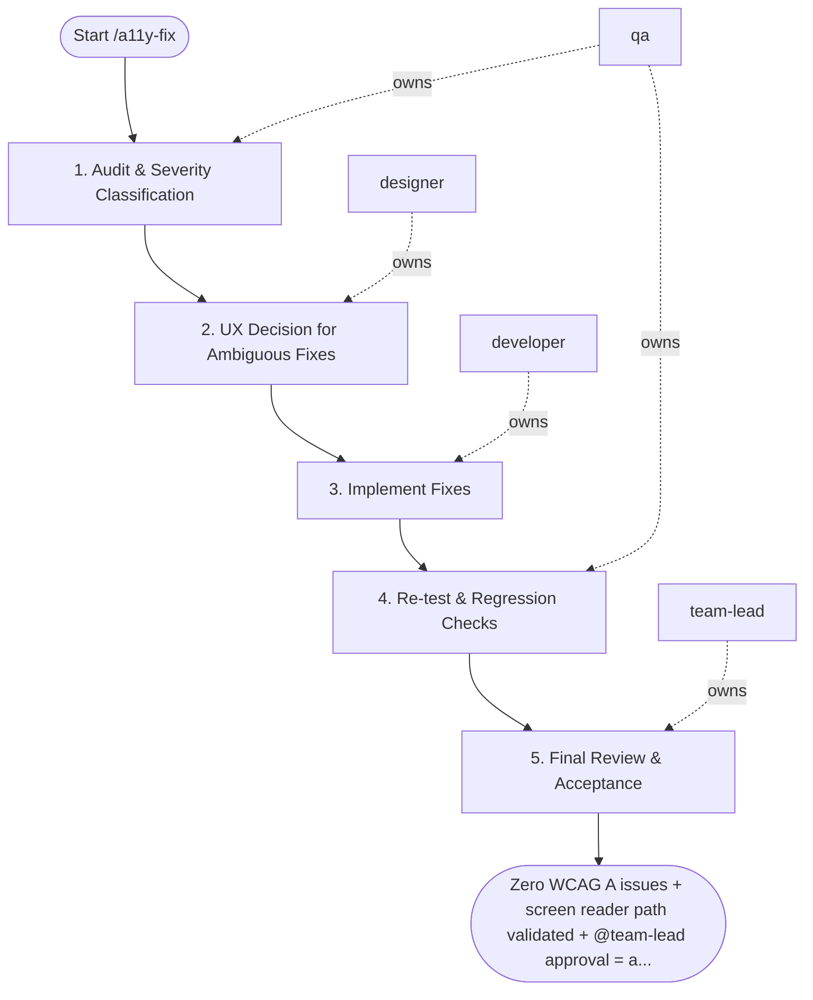

## Steps

### 1. Audit & Severity Classification — `@qa`
- **Input:** target route or component
- **Actions:** run automated audit (axe, Lighthouse, jest-axe); classify each finding by WCAG level (A / AA / AAA) and user impact; identify keyboard navigation and screen reader critical paths
- **Output:** `a11y_audit.md` — finding list with WCAG criterion, severity, and affected element
- **Done when:** all findings classified; critical path issues flagged

### 2. UX Decision for Ambiguous Fixes — `@designer`
- **Input:** audit findings that require UX judgment (alt text wording, focus order, label copy)
- **Actions:** review findings requiring design input; provide decisions on: alt text wording, ARIA label content, focus order, color contrast alternatives
- **Output:** design decisions documented per ambiguous finding
- **Done when:** all ambiguous findings have designer-approved decisions

### 3. Implement Fixes — `@developer`
- **Input:** audit + design decisions
- **Actions:** implement ARIA attributes, role corrections, focus management, color contrast fixes, keyboard handler improvements; follow `accessibility.md` rules; do not introduce visual regressions
- **Output:** fixes on feature branch
- **Done when:** all A-level issues addressed; AA issues addressed per project policy

### 4. Re-test & Regression Checks — `@qa`
- **Input:** fix branch
- **Actions:** re-run automated audit: zero new WCAG A issues; test keyboard navigation (Tab / Shift+Tab / Enter / Escape / Arrow keys); test with screen reader on at least one critical path; run visual regression to confirm no visual regressions
- **Output:** updated `a11y_report.md` — before/after comparison
- **Done when:** zero blocking A issues; critical keyboard and screen reader paths confirmed

### 5. Final Review & Acceptance — `@team-lead`
- **Input:** a11y report + fix branch
- **Actions:** verify fixes are complete and don't introduce regressions; sign off on WCAG compliance status
- **Output:** `@team-lead` approval
- **Done when:** approved; CI a11y checks added or confirmed

## Agent Interaction Diagram

<!-- agent-diagram:start -->

<!-- agent-diagram:end -->

## Exit
Zero WCAG A issues + screen reader path validated + `@team-lead` approval = a11y fix complete.

**Next:** terminal — no follow-up workflow.
