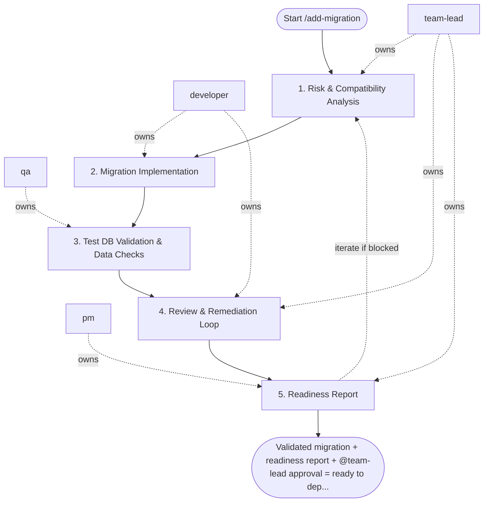

## Steps

### 1. Risk & Compatibility Analysis — `@team-lead`
- **Input:** schema change request + list of affected services
- **Actions:**
  - classify change: non-breaking (add nullable column, add index) vs. breaking (rename/drop column, change type, add NOT NULL)
  - for breaking changes: require expand/contract — two-phase migration across separate deployments
  - identify all consumers of the affected table/column; confirm backward-compatibility window
  - document rollback plan or mitigation (feature flag, dual-read window)
- **Output:** migration strategy doc: phases, compatibility window, rollback plan
- **Done when:** strategy approved; no services will break on forward migration

### 2. Migration Implementation — `@developer`
- **Input:** approved migration strategy
- **Actions:**
  - write migration script (Alembic, Flyway, Liquibase, etc.) following project conventions
  - Phase 1 (expand): add new column/table as nullable or with default; keep old structure intact
  - ensure migration is idempotent and reversible (`upgrade` + `downgrade` both implemented)
  - update application code to write to both old and new structures during transition if needed
- **Output:** migration file + updated application code on feature branch
- **Done when:** migration runs cleanly on local test DB; `downgrade` also verified

### 3. Test DB Validation & Data Checks — `@qa`
- **Input:** migration file + test DB
- **Actions:**
  - run `upgrade` on a copy of the test DB; verify schema matches expected state
  - run `downgrade`; verify clean revert with no data loss
  - execute affected queries and check index usage (EXPLAIN ANALYZE)
  - validate row counts and data integrity on key tables post-migration
- **Output:** `validation_report.md` — migration results, query plans, data integrity checks
- **Done when:** both directions validated; no unexpected data loss or performance degradation

### 4. Review & Remediation Loop — `@team-lead` + `@developer`
- **Input:** validation report
- **Actions:** `@team-lead` reviews migration SQL and application changes; flags any issues; `@developer` fixes and re-runs validation
- **Output:** approved migration
- **Done when:** `@team-lead` approves; no open issues in validation report

### 5. Readiness Report — `@pm` (or `@team-lead` if PM absent)
- **Input:** approved migration + validation report
- **Actions:** confirm deployment sequence (migrate before or after app rollout); document rollback command; note monitoring signals to watch post-deploy
- **Output:** `migration_readiness.md` with deployment steps, rollback command, monitoring checklist
- **Done when:** ops/release team has everything needed to deploy safely

## Agent Interaction Diagram

<!-- agent-diagram:start -->

<!-- agent-diagram:end -->

## Iteration Loop
If validation reveals data issues or compatibility risks → return to Step 1 for strategy revision.

## Exit
Validated migration + readiness report + `@team-lead` approval = ready to deploy.
