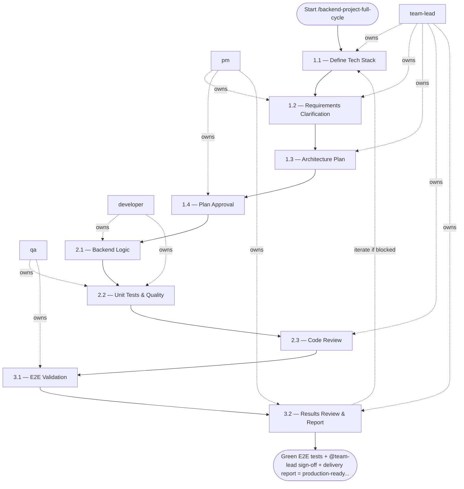

## Phase 1 — Planning

**Active skill:** `prompt-project-planner`  
**Owner:** `@pm` (gather requirements) → `@team-lead` (create architecture plan) → `@pm` (present to user)

### Step 1.1 — Define Tech Stack — `@team-lead`
- **Input:** business logic description
- **Actions:** confirm language, framework, database, messaging system; if not provided — ask user to select from available options
- **Output:** confirmed tech stack in plan header
- **Done when:** stack agreed upon with user

### Step 1.2 — Requirements Clarification — `@pm` + `@team-lead`
- **Input:** confirmed tech stack
- **Actions:** ask clarifying questions about: event schema & boundaries; domain entities & relationships; idempotency & deduplication strategies; storage models & access patterns; failure handling & retries; throughput expectations & scaling
- **Output:** answers documented in plan
- **Done when:** no open architecture questions

### Step 1.3 — Architecture Plan — `@team-lead`
- **Input:** clarified requirements
- **Actions:** produce plan following `output.schema.md` from `prompt-project-planner` skill; include: module layout inside `src/`, applied rules, selected skills, this workflow reference; do NOT write code
- **Output:** `docs/plans/plan_<task_id>.md`
- **Done when:** plan complete per schema

### Step 1.4 — Plan Approval — `@pm`
- **Input:** architecture plan
- **Actions:** present plan to user; explicitly ask: *"Is the plan approved and may I proceed to implementation?"*
- **Output:** explicit user approval
- **Done when:** user confirms approval in writing — do not proceed to Phase 2 without this

---

## Phase 2 — Implementation

**Active skill:** `app-builder`  
**Owner:** `@developer` (implement) → `@qa` (unit test) → `@team-lead` (review)

**Entry condition:** plan is explicitly approved by the user.

### Step 2.1 — Backend Logic — `@developer`
- **Input:** approved architecture plan
- **Actions:**
  - implement using selected tech stack; follow layered architecture (Domain / Service / Repository)
  - use strict typing and validation (Pydantic for Python, interfaces for TS, etc.)
  - implement DB migrations for all schema changes
  - implement clear boundaries for external systems (Kafka consumers, HTTP clients, etc.)
  - code ONLY in `src/`; tests ONLY in `tests/`
- **Output:** implemented backend logic on branch
- **Done when:** all planned modules implemented

### Step 2.2 — Unit Tests & Quality — `@developer` + `@qa`
- **Input:** implemented code
- **Actions:**
  - cover all business logic with unit tests
  - `make lint` — zero errors
  - `make test` — coverage ≥ 70%
- **Output:** green unit tests; lint clean
- **Done when:** coverage threshold met; no lint violations

### Step 2.3 — Code Review — `@team-lead`
- **Input:** implemented branch
- **Actions:** verify architecture plan followed; check layering, typing, error handling; approve or return with blocking feedback
- **Output:** review feedback
- **Done when:** all blocking feedback resolved; `@team-lead` approves

---

## Phase 3 — Blackbox Validation

**Active skill:** `blackbox-test`  
**Owner:** `@qa` (execute) → `@team-lead` (review results)

**Entry condition:** unit tests are green; `@team-lead` has approved Phase 2.

### Step 3.1 — E2E Validation — `@qa`
- **Input:** approved service code
- **Actions:**
  - start services via Docker: `docker compose up`
  - execute real API calls against running service
  - validate full business flows end-to-end
  - run: `make e2e-test`
  - do not duplicate unit test logic — test observable behavior only
- **Output:** E2E test results; `make e2e-test` exit code 0
- **Done when:** all E2E scenarios pass

### Step 3.2 — Results Review & Report — `@team-lead` + `@pm`
- **Input:** E2E results
- **Actions:** `@team-lead` reviews test coverage and quality signal; `@pm` produces final delivery report; add a `CHANGELOG.md` entry and bump the project version
- **Output:** `docs/delivery/delivery_report_<task_id>.md` — plan vs. delivered, test evidence, known gaps
- **Done when:** `@team-lead` signs off; report complete; `CHANGELOG.md` and version bump committed

## Agent Interaction Diagram

<!-- agent-diagram:start -->

<!-- agent-diagram:end -->

## Iteration Loop
Phase 2 Steps 2.1–2.3 repeat until `@team-lead` approves (maximum 3 revision cycles). Phase 3 failure loops back to Phase 2 for fixes (maximum 2 returns). Exceeding either bound stops the loop and escalates to `@product-owner` for a scope decision.

## Exit
Green E2E tests + `@team-lead` sign-off + delivery report = production-ready service.

**Next:** terminal — no follow-up workflow.
