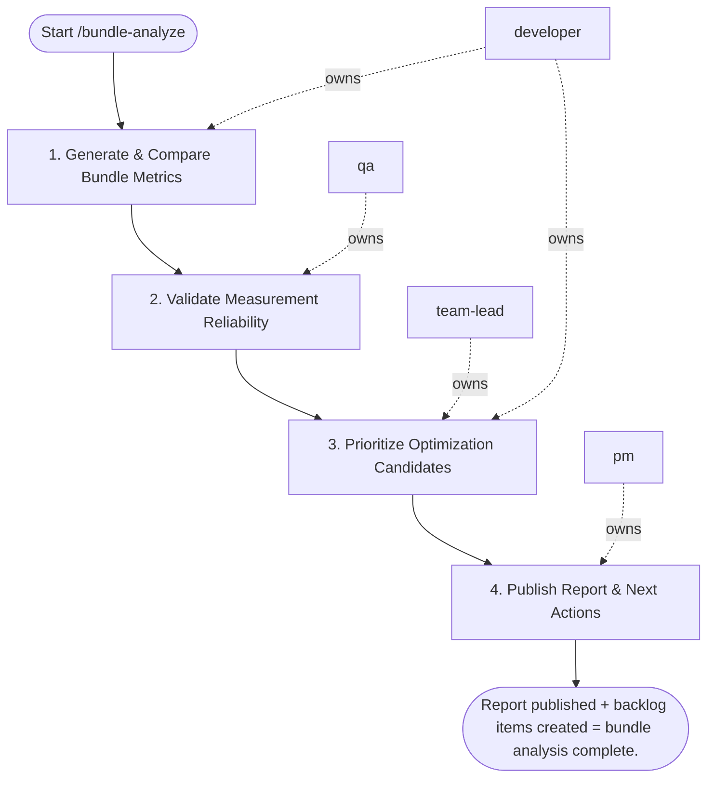

## Steps

### 1. Generate & Compare Bundle Metrics — `@developer`
- **Input:** build artifacts, baseline metrics
- **Actions:** run bundle analyzer (webpack-bundle-analyzer, vite-bundle-visualizer, source-map-explorer); compare current bundle sizes vs. baseline; flag any chunk exceeding performance budget; identify top contributors to size regression
- **Output:** bundle diff with size delta per chunk; budget violations flagged
- **Done when:** all chunks analyzed; violations identified

### 2. Validate Measurement Reliability — `@qa`
- **Input:** bundle metrics
- **Actions:** confirm measurement is reproducible (run analysis twice; results within 1%); verify build is production mode (no dev artifacts); confirm baseline was captured under same conditions
- **Output:** reliability confirmation or flag if measurements inconsistent
- **Done when:** measurements confirmed reliable

### 3. Prioritize Optimization Candidates — `@team-lead` + `@developer`
- **Input:** validated diff report
- **Actions:** rank candidates by: size impact × user impact × implementation effort; flag quick wins (unused imports, missing tree-shaking, large non-split chunks); flag strategic work (route-based code splitting, lazy-loaded components)
- **Output:** prioritized optimization list with effort estimates
- **Done when:** list reviewed; quick wins vs. strategic work separated

### 4. Publish Report & Next Actions — `@pm`
- **Input:** prioritized list
- **Actions:** produce `bundle_diff_report.md`: current vs. baseline sizes, budget violations, optimization backlog; schedule quick wins as engineering tasks; log strategic work in backlog
- **Output:** `bundle_diff_report.md`; backlog items created
- **Done when:** report shared; items logged in project tracker

## Agent Interaction Diagram

<!-- agent-diagram:start -->

<!-- agent-diagram:end -->

## Exit
Report published + backlog items created = bundle analysis complete.

**Next:** terminal — no follow-up workflow.
