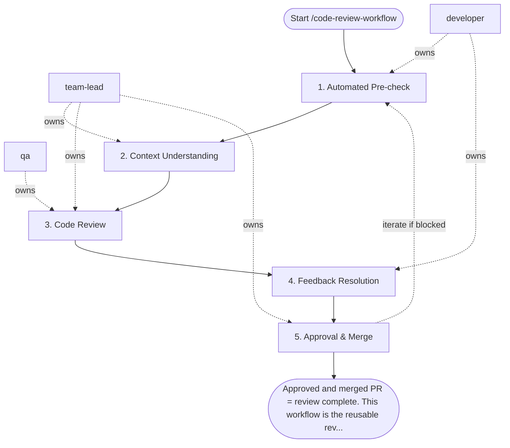

## Steps

### 1. Automated Pre-check — `@developer` (author)
- **Input:** feature branch with changes
- **Actions:** confirm CI passes (lint / tests / build); no merge conflicts; branch up to date with target
- **Output:** CI-green PR
- **Done when:** automated checks pass — only then request review

### 2. Context Understanding — `@team-lead`
- **Input:** PR description and linked issue/task
- **Actions:** read PR description and linked ticket; check scope focus; if diff > 400 lines of logic — request splitting the PR
- **Output:** decision to proceed or split
- **Done when:** reviewer understands the intent and scope is acceptable

### 3. Code Review — `@team-lead` + `@qa`
- **Input:** PR diff + context
- **Actions — Correctness:**
  - Does the code do what the ticket describes?
  - Are edge cases and error paths handled?
- **Actions — Design & Architecture:**
  - Does the change follow existing codebase patterns?
  - No unnecessary complexity or over-engineering?
  - Abstractions at the right level?
- **Actions — Code Quality:**
  - Names are clear and intention-revealing?
  - No duplicated logic that could be extracted?
  - No magic numbers or strings?
- **Actions — Tests:**
  - New behaviors covered by tests?
  - Tests assert meaningful behavior, not implementation details?
  - Edge cases tested?
- **Actions — Security:**
  - No secrets or credentials committed
  - User input validated/sanitized
  - Permissions and access control respected
- **Output:** review comments with blocking / non-blocking labels; at least one positive comment
- **Done when:** all review dimensions checked

### 4. Feedback Resolution — `@developer`
- **Input:** review comments
- **Actions:** address all blocking comments; push fixes as new commits (no force-push during review); re-request review
- **Output:** updated PR
- **Done when:** no open blocking comments

### 5. Approval & Merge — `@team-lead`
- **Input:** resolved PR
- **Actions:** re-check fixes; approve; author squashes or rebases per project convention; merge; delete feature branch
- **Output:** merged PR; branch deleted
- **Done when:** change merged and feature branch removed

## Agent Interaction Diagram

<!-- agent-diagram:start -->

<!-- agent-diagram:end -->

## Iteration Loop
If fixes introduce new issues → reviewer re-raises blocking comments. Maximum 3 review rounds; if blocking issues remain after the third, `@team-lead` decides between merging with follow-up tasks and rejecting the change.

## Exit
Approved and merged PR = review complete. This workflow is the reusable review phase invoked by delivery workflows (e.g. `/development-cycle-workflow` Step 6 and their spec equivalents).

**Next:** terminal — no follow-up workflow.
