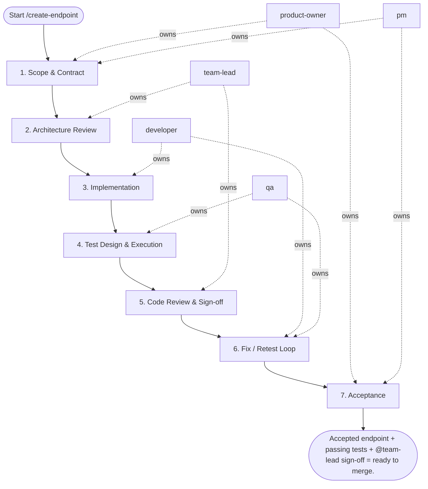

## Steps

### 1. Scope & Contract — `@product-owner` + `@pm`
- **Input:** endpoint request
- **Actions:** define HTTP method, path, request/response schema, error codes, auth requirements, non-goals
- **Output:** API contract doc or OpenAPI snippet in `docs/<feature>/api-contract.md`
- **Done when:** contract is unambiguous and approved

### 2. Architecture Review — `@team-lead`
- **Input:** API contract
- **Actions:** verify contract aligns with existing API conventions (per `api-design` skill); confirm data model impact; identify performance and security risks (N+1, injection surface, auth scope); approve or request changes
- **Output:** architecture approval + notes on risks
- **Done when:** `@team-lead` approves; implementation approach clear

### 3. Implementation — `@developer`
- **Input:** approved contract + architecture notes
- **Actions:**
  - update schemas/DTOs for input validation (Pydantic, Joi, etc.)
  - implement repository method if new DB query needed — check indexes
  - implement service layer logic with error handling and business rules
  - wire API layer: route, auth middleware, response serialization
  - do not put business logic in the API handler
- **Output:** endpoint implemented on feature branch
- **Done when:** endpoint handles all contract scenarios; no lint errors

### 4. Test Design & Execution — `@qa`
- **Input:** implemented endpoint + API contract
- **Actions:**
  - write integration tests covering: happy path, validation errors (400), auth errors (401/403), not-found (404), edge cases
  - verify input sanitization and auth enforcement manually
  - check response schema matches contract
- **Output:** test suite passing; `docs/<feature>/test_report.md`
- **Done when:** all contract scenarios tested and passing; security checks confirmed

### 5. Code Review & Sign-off — `@team-lead`
- **Input:** feature branch + test report
- **Actions:** verify layering rules respected; check error handling completeness; confirm observability (request logged, errors traced); provide feedback as blocking / non-blocking
- **Output:** review feedback (PR comments or `review_feedback.md`)
- **Done when:** all blocking comments resolved; `@team-lead` approves

### 6. Fix / Retest Loop — `@developer` + `@qa`
- **Input:** blocking feedback
- **Actions:** fix issues; re-run tests; re-request review; maximum 3 fix/retest cycles — if still blocked after the third, stop and escalate to `@team-lead` with the open blocker list for a decision
- **Output:** updated branch
- **Done when:** zero blocking issues; tests green

### 7. Acceptance — `@product-owner` + `@pm`
- **Input:** verified endpoint + test evidence
- **Actions:** `@product-owner` confirms endpoint meets business need; `@pm` records delivery notes; update endpoint docs under `docs/**`, add a `CHANGELOG.md` entry, and bump the project version
- **Output:** endpoint accepted; delivery note in `docs/<feature>/delivery_summary.md`
- **Done when:** `@product-owner` signs off; docs, `CHANGELOG.md`, and version bump committed

## Agent Interaction Diagram

<!-- agent-diagram:start -->

<!-- agent-diagram:end -->

## Exit
Accepted endpoint + passing tests + `@team-lead` sign-off = ready to merge.

**Next:** terminal — no follow-up workflow.
