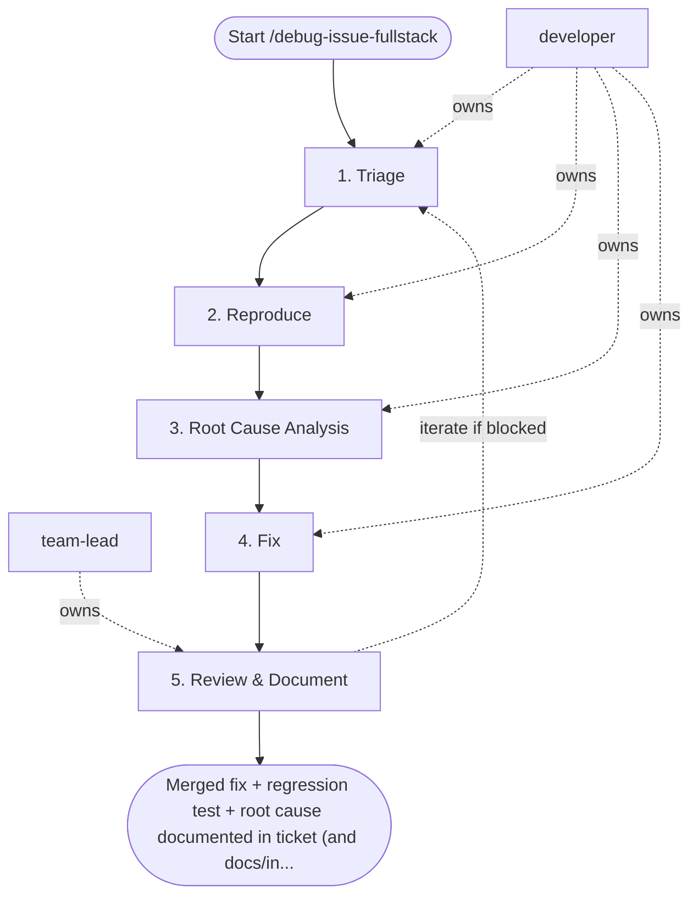

## Steps

### 1. Triage — `@developer`
- **Input:** issue description, error logs, environment context
- **Actions:** classify severity (P1 data loss/outage, P2 functional break, P3 cosmetic); identify affected component from stack trace; check if reproducible in staging; check recent deploys and migrations that could have caused this
- **Output:** triage note — severity, affected layer, reproduction status
- **Done when:** severity assigned; reproduction path identified or deemed flaky

### 2. Reproduce — `@developer`
- **Input:** triage note, reproduction steps
- **Actions:** write a failing test that demonstrates the bug (unit or integration); if E2E: write Playwright test; run test — **must fail** before any fix; if test cannot be written, document why
- **Output:** failing test committed to branch `fix/<issue-id>`
- **Done when:** test reproduces issue deterministically; committed

### 3. Root Cause Analysis — `@developer`
- **Input:** failing test, code
- **Actions:** use `EXPLAIN ANALYZE` for slow/incorrect queries; check log correlation (`request_id`); trace data through layers (API → Service → Repository → DB); identify exact line/condition causing the bug
- **Output:** root cause comment in ticket + code location identified
- **Done when:** root cause statement: "Bug is caused by [specific condition] in [file:line]"

### 4. Fix — `@developer`
- **Input:** root cause, failing test
- **Actions:** implement minimal fix; run regression test — **must now pass**; run full test suite to check for regressions; fix must be in the correct architectural layer (don't fix a service bug in the API layer)
- **Output:** fix committed; tests passing
- **Done when:** regression test green; full suite green; `make lint` clean

### 5. Review & Document — `@team-lead`
- **Input:** fix + tests from step 4 (branch `fix/<issue-id>`)
- **Actions:** review that fix addresses root cause not symptoms; verify regression test quality; for P1/P2 write `docs/incidents/<date>-<issue-id>-root-cause.md`; PR includes: root cause, fix rationale, test evidence
- **Output:** approved PR; root cause documented
- **Done when:** PR merged; `docs/incidents/` entry committed for P1/P2 issues

## Agent Interaction Diagram

<!-- agent-diagram:start -->

<!-- agent-diagram:end -->

## Iteration Loop
If fix reveals deeper root cause → return to Step 3 with updated understanding. Maximum 2 returns; after the second, stop and escalate to `@team-lead` with the findings so far to decide between a deeper investigation task or a mitigation-only fix.

## Exit
Merged fix + regression test + root cause documented in ticket (and `docs/incidents/` for P1/P2).

**Next:** terminal — no follow-up workflow.
