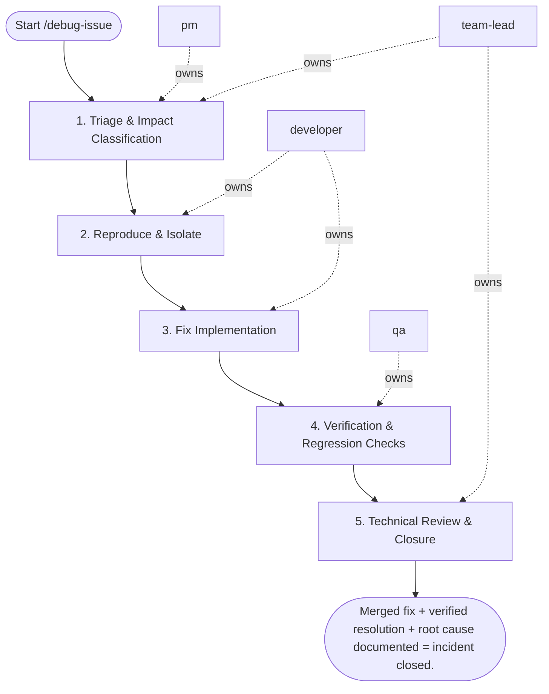

## Steps

### 1. Triage & Impact Classification — `@pm` + `@team-lead`
- **Input:** bug report or incident alert
- **Actions:** confirm business impact and affected users; classify severity (P0 critical / P1 high / P2 normal); assign owner; set expected resolution time
- **Output:** severity label + assigned owner + ETA in ticket
- **Done when:** severity agreed; `@developer` assigned and briefed

### 2. Reproduce & Isolate — `@developer`
- **Input:** triaged ticket from step 1 (bug report + severity + owner) + logs/metrics/traces (use `observability` skill to query)
- **Actions:**
  - reproduce the issue in a local or staging environment — do not fix without reproducing first
  - narrow to the smallest reproducible case
  - identify the code path: which layer (API / service / repository / infra)?
  - check recent commits touching that area: `git log -p -- <file>`
- **Output:** confirmed reproduction steps + suspected root cause hypothesis
- **Done when:** issue reliably reproducible; root cause narrowed to a specific code area

### 3. Fix Implementation — `@developer`
- **Input:** reproduction + root cause hypothesis
- **Actions:**
  - write a failing regression test first (proves the bug exists)
  - implement the minimal fix that makes the test pass
  - check for related occurrences of the same pattern elsewhere in the codebase
  - run full test suite to confirm no regressions: `make test`
- **Output:** fix + regression test on feature branch; all tests passing
- **Done when:** regression test passes; full suite green; fix is minimal and safe

### 4. Verification & Regression Checks — `@qa`
- **Input:** fix branch with regression test from step 3
- **Actions:**
  - reproduce original issue with fix applied — confirm resolved
  - run regression test suite on affected module
  - perform exploratory checks on related functionality
  - verify fix in staging environment if P0/P1
- **Output:** `verification_report.md` — confirmed fix, regression results, env tested
- **Done when:** issue resolved in all tested environments; no new failures introduced

### 5. Technical Review & Closure — `@team-lead`
- **Input:** fix branch + `verification_report.md` from step 4
- **Actions:** review fix for correctness and side effects; confirm root cause analysis is complete; check that regression test is sufficient; write or approve `root_cause_summary.md` with prevention note; for P0/P1 issues, save the summary as `docs/incidents/<date>-<issue-id>-root-cause.md`
- **Output:** `root_cause_summary.md` — what failed, why, how fixed, how to prevent (for P0/P1: `docs/incidents/<date>-<issue-id>-root-cause.md`)
- **Done when:** `@team-lead` approves fix; root cause documented; ticket closed

## Agent Interaction Diagram

<!-- agent-diagram:start -->

<!-- agent-diagram:end -->

## Exit
Merged fix + verified resolution + root cause documented = incident closed.

**Next:** terminal — no follow-up workflow.
