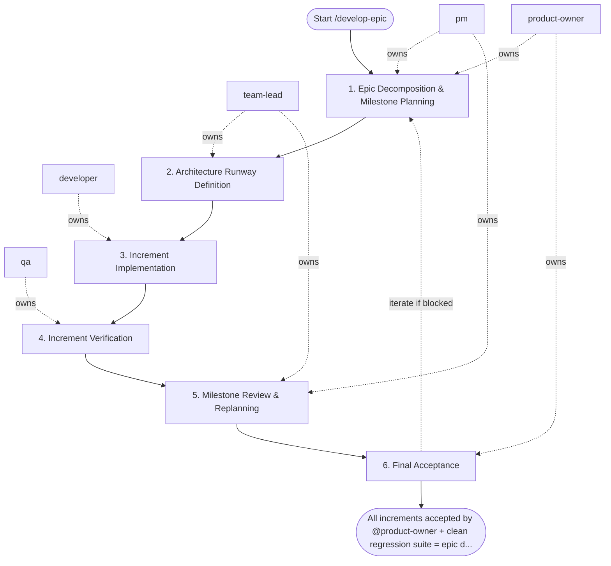

## Steps

### 1. Epic Decomposition & Milestone Planning — `@product-owner` + `@pm`
- **Input:** epic goals and high-level backlog
- **Actions:** decompose epic into independently deliverable increments (max 1–2 weeks each); define milestone acceptance criteria; prioritize increments by value and risk; identify inter-increment dependencies
- **Output:** `docs/<epic>/epic_plan.md` — increment list, acceptance criteria per increment, dependency map
- **Done when:** `@product-owner` approves scope; `@pm` has a delivery sequence

### 2. Architecture Runway Definition — `@team-lead`
- **Input:** epic plan
- **Actions:** identify shared infrastructure needed across increments (DB schema, shared services, API contracts); design the architecture runway — foundational work that must precede feature increments; document module layout and inter-service contracts; flag risks and non-functional requirements (performance, security, scalability)
- **Output:** `docs/<epic>/architecture_notes.md` — layering decisions, migration plan, risk register
- **Done when:** architecture runway approved; `@developer` can start Increment 1

### 3. Increment Implementation — `@developer`
- **Input:** increment spec from epic plan + architecture notes
- **Actions:** implement current increment per `/develop-feature` workflow (Steps 3–5 of that workflow); each increment must have its own branch, tests, and acceptance evidence; do not start next increment without current one passing verification
- **Output:** implemented increment on branch with passing checks
- **Done when:** increment passes local checks and is ready for QA

### 4. Increment Verification — `@qa`
- **Input:** implemented increment
- **Actions:** verify acceptance criteria for the current increment; run regression tests against all previously merged increments; document any cross-increment integration issues
- **Output:** increment test report; integration risk notes if any
- **Done when:** increment accepted; no regressions introduced

### 5. Milestone Review & Replanning — `@pm` + `@team-lead`
- **Input:** completed increment(s) + integration risk notes
- **Actions:** review progress against epic plan; replan remaining increments based on learnings; update risk register; communicate status to `@product-owner`; adjust scope if needed (add/drop items with `@product-owner` approval)
- **Output:** updated `epic_plan.md`; `risk_register.md` updated; stakeholders informed
- **Done when:** next increment is prioritized and `@developer` is briefed

### 6. Final Acceptance — `@product-owner`
- **Input:** all increments delivered + complete risk summary
- **Actions:** validate all epic acceptance criteria are met; review risk register for residual items; make go/defer decision on any remaining scope
- **Output:** `docs/<epic>/delivery_summary.md` — accepted items, deferred items, follow-up backlog
- **Done when:** epic accepted; follow-up items logged

## Agent Interaction Diagram

<!-- agent-diagram:start -->

<!-- agent-diagram:end -->

## Iteration Loop
Steps 3–5 repeat for each increment. Replanning in Step 5 governs scope adjustments.

## Exit
All increments accepted by `@product-owner` + clean regression suite = epic delivered.
