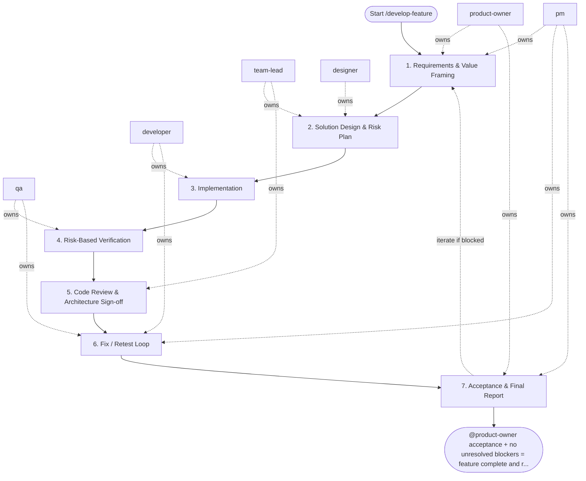

## Steps

### 1. Requirements & Value Framing — `@product-owner` + `@pm`
- **Input:** feature request from stakeholder or backlog
- **Actions:** define problem statement, expected outcomes, acceptance criteria, non-goals; confirm scope is implementation-ready
- **Output:** `docs/<feature>/README.md` with acceptance criteria
- **Done when:** criteria are testable and approved by `@product-owner`

### 2. Solution Design & Risk Plan — `@team-lead` + `@designer`
- **Input:** approved acceptance criteria
- **Actions:** identify impacted domain entities and service boundaries; design API contracts and data model changes; define UX states and interaction constraints; flag security and performance risks; confirm approach with `@developer` for feasibility
- **Output:** `docs/<feature>/implementation_plan.md` — layers affected, risks, migration notes if any
- **Done when:** `@team-lead` and `@designer` approve plan; no open architecture blockers

### 3. Implementation — `@developer`
- **Input:** approved implementation plan
- **Actions:**
  - implement changes layer by layer (inner to outer): models/schemas → repository → service → API
  - follow architecture rule: no business logic in API layer, no DB access in service layer directly
  - add or update unit tests alongside implementation
  - run `make lint && make test` locally before handoff
- **Output:** code changes on feature branch with passing local checks
- **Done when:** all acceptance criteria implemented; local checks green

### 4. Risk-Based Verification — `@qa`
- **Input:** feature branch + acceptance criteria
- **Actions:**
  - design test scenarios covering happy path, edge cases, failure paths
  - execute automated tests (unit + integration); run exploratory checks for acceptance criteria
  - verify security constraints (auth, input validation) per `security.md`
  - document findings with severity classification
- **Output:** `docs/<feature>/test_report.md` — pass/fail per scenario, defect list
- **Done when:** no critical or high-severity open defects

### 5. Code Review & Architecture Sign-off — `@team-lead`
- **Input:** feature branch + test report
- **Actions:** review layering and dependency rules; check test coverage quality; verify observability (logs, metrics, traces per `observability` skill); provide feedback as blocking / non-blocking
- **Output:** `review_feedback.md` or inline PR comments
- **Done when:** `@team-lead` approves; all blocking comments resolved

### 6. Fix / Retest Loop — `@developer` + `@qa` (coordinated by `@pm`)
- **Input:** blocking feedback list
- **Actions:** `@developer` fixes; `@qa` retests affected scenarios; loop until no open blockers
- **Output:** updated code + updated test report
- **Done when:** zero open blocking issues

### 7. Acceptance & Final Report — `@product-owner` + `@pm`
- **Input:** verified increment + risk summary
- **Actions:** `@product-owner` validates acceptance criteria; `@pm` produces delivery summary with decisions and follow-ups
- **Output:** `docs/<feature>/delivery_summary.md` — accepted / deferred with rationale
- **Done when:** feature accepted or explicitly deferred

## Agent Interaction Diagram

<!-- agent-diagram:start -->

<!-- agent-diagram:end -->

## Iteration Loop
Steps 3–6 repeat per increment for large features. `@pm` tracks scope changes and timeline impact.

## Mandatory Role Delegation
- For `/develop-feature`, the executor must spawn exactly 6 subagents, one per role: `@product-owner`, `@pm`, `@team-lead`, `@developer`, `@qa`, `@designer`.
- Role consolidation is forbidden: one subagent cannot own multiple roles.
- Implementation work may start only after requirements outputs from `@product-owner` and `@pm`, and design outputs from `@team-lead` and `@designer`, are complete.
- Final delivery requires QA recommendation and team-lead sign-off.

## Exit
`@product-owner` acceptance + no unresolved blockers = feature complete and ready for release.
