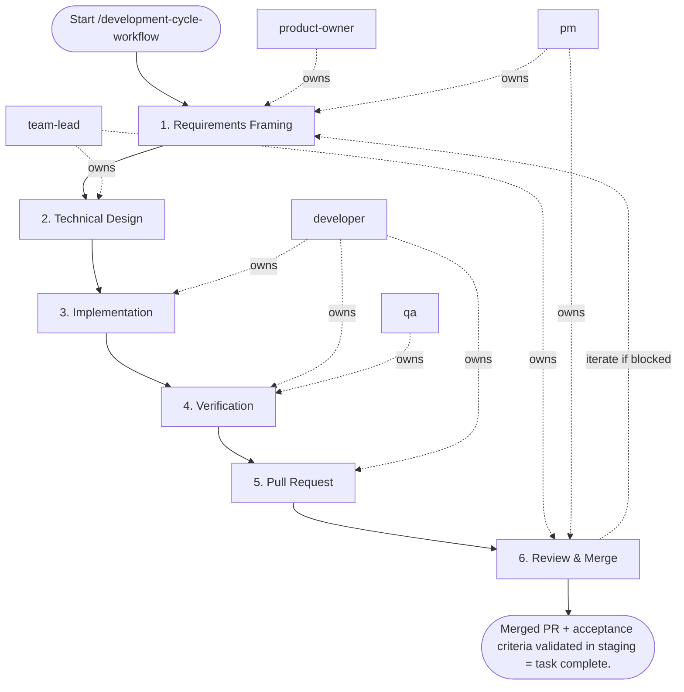

## Steps

### 1. Requirements Framing — `@product-owner` + `@pm`
- **Input:** task or issue description
- **Actions:** define acceptance criteria; clarify scope and non-goals; if larger than 1 day of work — break into sub-tasks
- **Output:** confirmed acceptance criteria added to the ticket
- **Done when:** criteria are testable and agreed upon

### 2. Technical Design — `@team-lead`
- **Input:** confirmed acceptance criteria
- **Actions:** identify impacted code areas; flag architectural risks; approve approach or request changes
- **Output:** brief design note (inline comment or `docs/<task>/notes.md` for significant changes)
- **Done when:** implementation approach is unambiguous

### 3. Implementation — `@developer`
- **Input:** confirmed acceptance criteria + design note
- **Actions:**
  - pull latest `main`, create branch: `git checkout -b feature/<task-id>-short-desc`
  - implement in small logical commits; follow code style rules
  - run `make fmt` after each logical change
  - do not mix unrelated changes in the same branch
- **Output:** code changes on feature branch
- **Done when:** implementation covers all acceptance criteria

### 4. Verification — `@developer` → `@qa`
- **Input:** code changes on branch
- **Actions:**
  - `make test` — all tests pass
  - `make lint` — zero errors
  - `make fmt` — no diffs
  - add or update tests for any new behavior
  - `@qa` runs exploratory checks against acceptance criteria
- **Output:** green local checks; test evidence attached to PR
- **Done when:** no failing checks; acceptance criteria manually verified

### 5. Pull Request — `@developer`
- **Input:** green checks, test evidence
- **Actions:** open PR with title `[TASK-ID] Short description`; body includes what changed, why, how to test, screenshots if UI; assign reviewer; CI must pass before review
- **Output:** open PR with passing CI
- **Done when:** PR is open and CI is green

### 6. Review & Merge — `@team-lead` (coordinated by `@pm`)
- **Input:** open PR
- **Actions:** `@team-lead` reviews code quality, architecture, and tests; `@developer` addresses all blocking comments; squash or rebase per project convention; merge; delete feature branch
- **Output:** merged PR; feature branch deleted
- **Done when:** PR is merged and change is verified in staging/preview

## Agent Interaction Diagram

<!-- agent-diagram:start -->

<!-- agent-diagram:end -->

## Iteration Loop
If verification (Step 4) or review (Step 6) reveals gaps → return to Step 3. `@pm` tracks blockers and timeline.

## Exit
Merged PR + acceptance criteria validated in staging = task complete.
