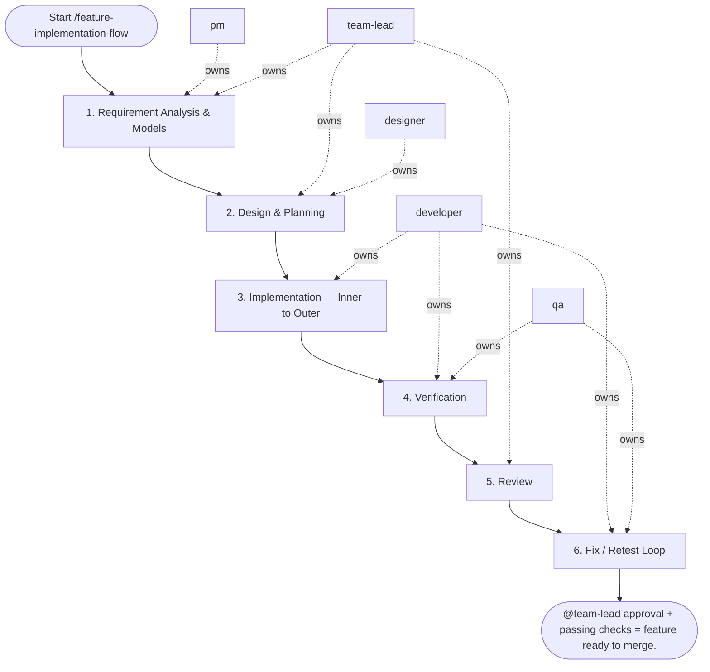

## Steps

### 1. Requirement Analysis & Models — `@pm` + `@team-lead`
- **Input:** feature request
- **Actions:** `@pm` captures requirements; `@team-lead` identifies impacted domain entities and determines if schema changes are needed; if UI is involved, `@designer` delivers the UI spec/mockup artifact (`docs/<feature>/ui_spec.md` or linked mockup)
- **Output:** confirmed feature spec with data model notes (+ `@designer` UI spec/mockup when UI is involved)
- **Done when:** impacted layers identified; `@developer` briefed

### 2. Design & Planning — `@team-lead` + `@designer`
- **Input:** confirmed feature spec
- **Actions:** design layer changes (models → repository → service → API); specify Pydantic/DTO schemas for input/output; plan Alembic migration if schema changes needed; define UX states (loading / empty / error / success) if frontend involved
- **Output:** brief implementation plan presented to `@pm` for user confirmation
- **Done when:** user/stakeholder confirms plan; approach is approved

### 3. Implementation — Inner to Outer — `@developer`
- **Input:** approved implementation plan
- **Actions:**
  - **Models/Schemas:** update `src/models/` (SQLAlchemy) if schema changes; create Alembic migration; define Pydantic input/output schemas in `src/schemas/`
  - **Repository Layer:** implement data access methods in `src/repositories/`; ensure IO-bound operations are async
  - **Service Layer:** implement business logic in `src/services/`; inject repository dependencies; handle exceptions, convert to business errors; do not import FastAPI/Flask objects here
  - **API Layer:** add/update endpoints in `src/api/`; validate input via schemas; call service methods only; no direct DB access
- **Output:** feature implemented on branch; no cross-layer violations
- **Done when:** all layers implemented; local checks pass

### 4. Verification — `@developer` + `@qa`
- **Input:** implemented feature branch
- **Actions:**
  - unit tests: test service logic (mock repositories); test repository logic (test DB or mocks)
  - integration tests: test API endpoints end-to-end with test client
  - `make lint` — zero errors; `make fmt` — no diffs; strict typing verified
  - `@qa` runs acceptance checks against feature spec
- **Output:** passing test suite; lint/type checks clean
- **Done when:** all checks pass; acceptance criteria verified

### 5. Review — `@team-lead`
- **Input:** feature branch + test results
- **Actions:** verify layer boundaries respected; check schema definitions and error handling; review test quality; provide blocking / non-blocking feedback
- **Output:** review feedback
- **Done when:** all blocking feedback resolved; `@team-lead` approves

### 6. Fix / Retest Loop — `@developer` + `@qa`
- **Input:** blocking feedback
- **Actions:** fix; re-run checks; re-request review; maximum 3 fix/retest cycles — if still blocked after the third, stop and escalate to `@team-lead` with the open blocker list for a decision; once approved, update feature docs under `docs/**`, add a `CHANGELOG.md` entry, and bump the project version
- **Output:** green test run + review-ready branch
- **Done when:** zero blocking issues; all checks green; docs, `CHANGELOG.md`, and version bump committed

## Agent Interaction Diagram

<!-- agent-diagram:start -->

<!-- agent-diagram:end -->

## Exit
`@team-lead` approval + passing checks = feature ready to merge.

**Next:** terminal — no follow-up workflow.
