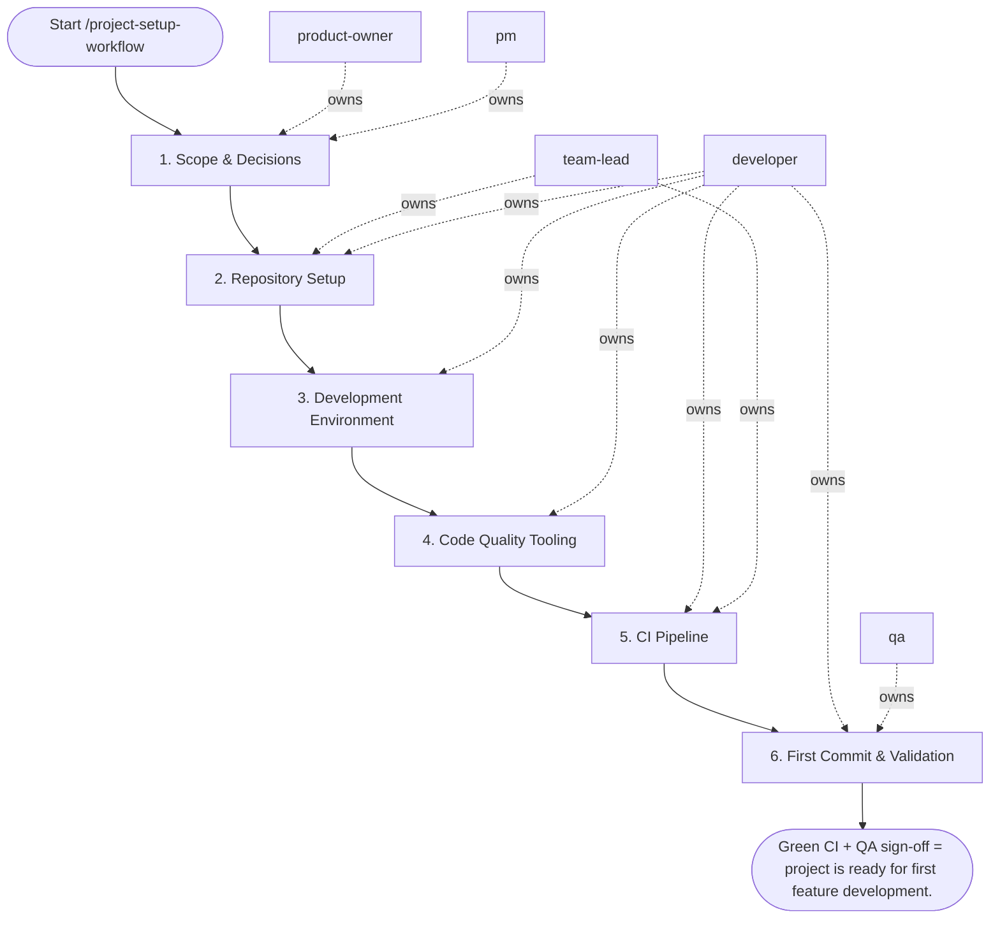

## Steps

### 1. Scope & Decisions — `@product-owner` + `@pm`
- **Input:** project name, purpose, team constraints
- **Actions:** confirm language/framework/platform; define team conventions (branch model, merge strategy); confirm initial milestone
- **Output:** brief project charter note (README draft or ADR-0)
- **Done when:** tech stack and conventions agreed upon

### 2. Repository Setup — `@team-lead` + `@developer`
- **Input:** project charter note
- **Actions:**
  - create repo on GitHub/GitLab with meaningful name and description
  - set up branch protection on `main` (require CI + review)
  - add `.gitignore` for the language/framework
  - add `README.md` with: description, prerequisites, quick start (`make install && make dev`), CI badge
- **Output:** initialized repository with branch protection
- **Done when:** repo accessible, branch protection active

### 3. Development Environment — `@developer`
- **Input:** initialized repository
- **Actions:**
  - create `Makefile` with targets: `install`, `dev`, `test`, `lint`, `fmt`, `clean`, `help`
  - if multi-service: create `docker-compose.yml` with health checks and `.env.example`
  - configure language toolchain (venv, node_modules, go modules, etc.)
  - add `.editorconfig` for consistent whitespace
- **Output:** working local dev environment
- **Done when:** `make install && make dev` succeeds on a clean machine

### 4. Code Quality Tooling — `@developer`
- **Input:** working dev environment
- **Actions:**
  - add linter config (`.eslintrc`, `pyproject.toml [tool.ruff]`, `.golangci.yml`, etc.)
  - add formatter config (`prettier`, `black`, etc.)
  - configure `pre-commit` with at minimum: trailing-whitespace, end-of-file-fixer, check-yaml
  - run `pre-commit install` and `pre-commit run --all-files` — fix any issues
- **Output:** linter + formatter + pre-commit hooks configured and passing
- **Done when:** `make lint` and `make fmt` exit clean on the initial codebase

### 5. CI Pipeline — `@developer` + `@team-lead`
- **Input:** quality tooling configured
- **Actions:**
  - create CI config (`.github/workflows/ci.yml` or `.gitlab-ci.yml`)
  - pipeline runs: lint → test → build on every PR
  - set branch protection to require passing CI before merge
  - add CI status badge to README
- **Output:** CI pipeline running on the repo
- **Done when:** CI passes on `main`

### 6. First Commit & Validation — `@developer` + `@qa`
- **Input:** all tooling configured
- **Actions:**
  - `git add -A && git commit -m "chore: initial project setup"`
  - push and verify CI passes on default branch
  - `@qa` validates: clean install on a second machine, CI badge green, `make test` passes
  - create first `CHANGELOG.md` entry: `## [Unreleased]`
- **Output:** green CI on first commit; validated by QA
- **Done when:** CI green, QA confirms setup is reproducible

## Agent Interaction Diagram

<!-- agent-diagram:start -->

<!-- agent-diagram:end -->

## Exit
Green CI + QA sign-off = project is ready for first feature development.
