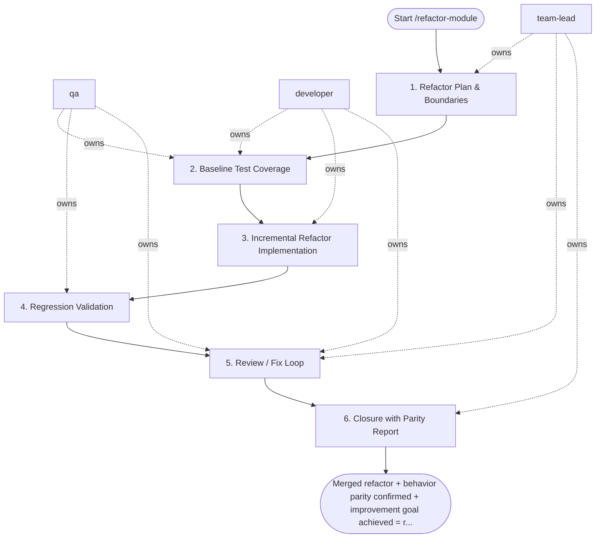

## Steps

### 1. Refactor Plan & Boundaries — `@team-lead`
- **Input:** refactor goal (e.g. extract service layer, reduce coupling, eliminate duplication)
- **Actions:** define exact scope boundaries — what changes and what does NOT change; identify all callers/consumers of the module being refactored; define "behavior baseline" — the set of tests that must still pass after refactor; flag risk areas (shared state, async flows, external integrations)
- **Output:** `docs/<refactor>/refactor_plan.md` — scope, boundaries, baseline test list, risk notes
- **Done when:** `@team-lead` approves plan; boundaries are unambiguous

### 2. Baseline Test Coverage — `@qa` + `@developer`
- **Input:** refactor plan + current codebase
- **Actions:** ensure all critical flows in scope are covered by automated tests before any changes; add missing tests if coverage gaps exist — this is the safety net; document the baseline coverage metrics
- **Output:** baseline test suite passing; coverage metrics recorded
- **Done when:** critical flows are covered; `make test` green on current code

### 3. Incremental Refactor Implementation — `@developer`
- **Input:** approved plan + baseline tests
- **Actions:**
  - refactor in small, reviewable increments — one conceptual change per commit
  - run `make test` after each commit — if tests break, revert immediately
  - do not change behavior while refactoring — behavior changes require a separate PR
  - use strangler fig or parallel implementation pattern for high-risk module replacements
- **Output:** refactored module on feature branch; all baseline tests passing
- **Done when:** all planned scope refactored; baseline tests still green; no behavior changes introduced

### 4. Regression Validation — `@qa`
- **Input:** refactored branch
- **Actions:** run full regression suite; perform exploratory testing on affected flows; compare observable behavior (API responses, DB state, logs) against baseline; verify performance is not degraded (run EXPLAIN ANALYZE on key queries if DB touched)
- **Output:** `behavior_parity_evidence.md` — test results, behavior comparison, performance check
- **Done when:** no regressions detected; behavior parity confirmed

### 5. Review / Fix Loop — `@team-lead` + `@developer` + `@qa`
- **Input:** refactored branch + parity evidence
- **Actions:** `@team-lead` reviews structural improvements against plan goals; flags any remaining issues; `@developer` fixes; `@qa` re-verifies
- **Output:** approved refactor
- **Done when:** `@team-lead` confirms improvement is achieved; no open issues

### 6. Closure with Parity Report — `@team-lead`
- **Input:** approved refactor
- **Actions:** confirm that the refactor achieved its stated goal (reduced complexity, improved layering, etc.); sign off with a brief note on what was improved
- **Output:** merge approval + note in `refactor_plan.md`: "Goal achieved: <description>"
- **Done when:** PR merged

## Agent Interaction Diagram

<!-- agent-diagram:start -->

<!-- agent-diagram:end -->

## Exit
Merged refactor + behavior parity confirmed + improvement goal achieved = refactor complete.
