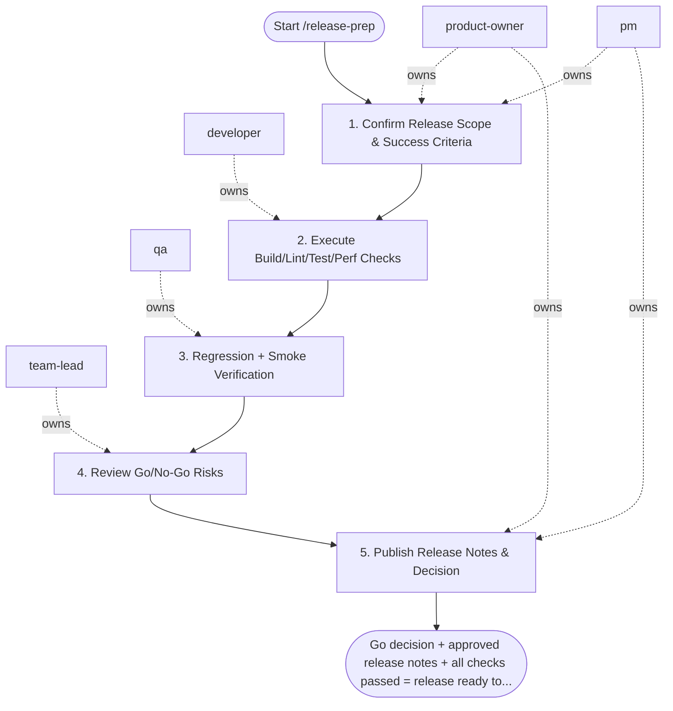

## Steps

### 1. Confirm Release Scope & Success Criteria — `@product-owner` + `@pm`
- **Input:** release scope, target version
- **Actions:** confirm what's in and out of the release; define success criteria for release (metrics, feature flags to enable); align on rollback trigger conditions
- **Output:** confirmed release scope + success criteria
- **Done when:** scope locked; `@product-owner` approved

### 2. Execute Build/Lint/Test/Perf Checks — `@developer`
- **Input:** confirmed scope
- **Actions:** `make lint` — zero errors; `make test` — all pass; `make build` — production build clean; run bundle analysis against budget; run Lighthouse for performance and a11y scores
- **Output:** all check results; any regressions flagged
- **Done when:** all checks pass; no budget regressions or regressions accepted with rationale

### 3. Regression + Smoke Verification — `@qa`
- **Input:** built release candidate
- **Actions:** run regression test suite for release scope; run smoke suite on staging with release candidate; confirm critical user paths work end-to-end; run visual regression check on changed routes
- **Output:** `qa_release_report.md` — suite results, smoke results, visual diff status
- **Done when:** no blocking failures; go recommendation from `@qa`

### 4. Review Go/No-Go Risks — `@team-lead`
- **Input:** all check and test results
- **Actions:** review residual risks; confirm rollback procedure is documented and tested; make explicit go/no-go recommendation
- **Output:** go/no-go decision with rationale
- **Done when:** decision explicit; rationale documented

### 5. Publish Release Notes & Decision — `@pm` + `@product-owner`
- **Input:** go decision
- **Actions:** `@pm` drafts release notes (features, fixes, known issues); `@product-owner` approves notes; update `CHANGELOG.md` with user-facing changes and bump the version source — required before handoff; publish to stakeholders; hand off to `/deploy-production`
- **Output:** approved release notes; team informed
- **Done when:** notes approved; CHANGELOG and version updated; deployment team has green light

## Agent Interaction Diagram

<!-- agent-diagram:start -->

<!-- agent-diagram:end -->

## Exit
Go decision + approved release notes + all checks passed = release ready to deploy.

**Next:** /deploy-production — deploy the prepared release.
