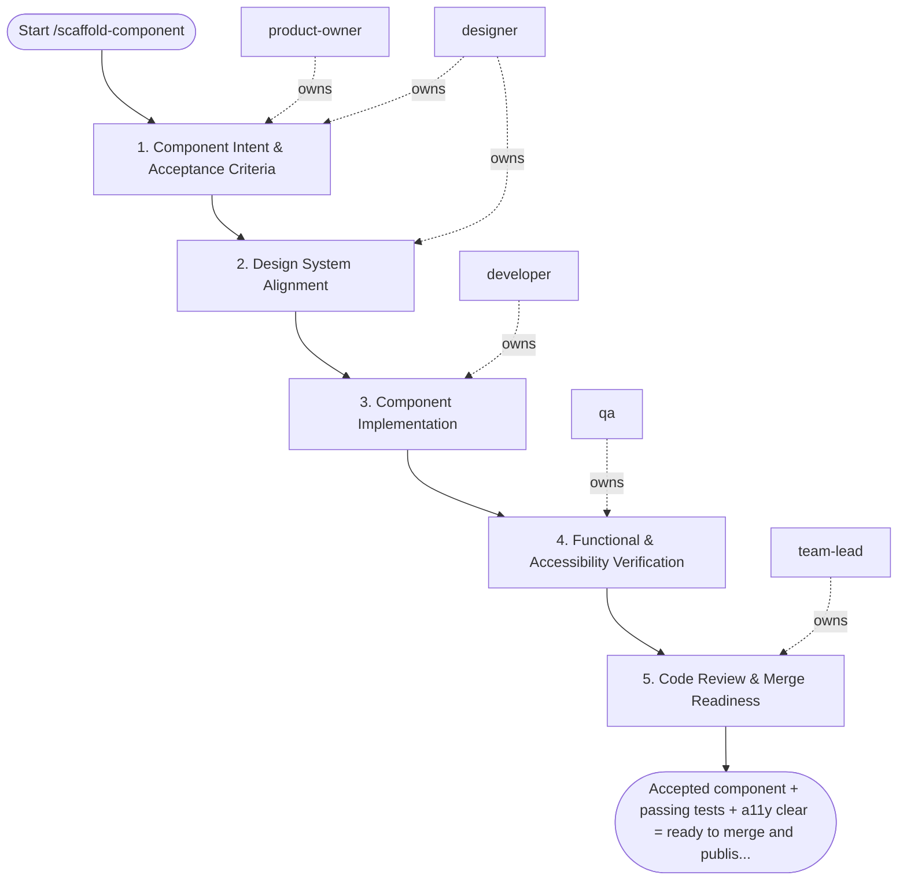

## Steps

### 1. Component Intent & Acceptance Criteria — `@product-owner` + `@designer`
- **Input:** component request
- **Actions:** define component purpose, consumer context, and expected states (loading / empty / error / success / permission-denied); `@designer` specifies interaction design, token usage, and accessibility requirements
- **Output:** component spec with acceptance criteria and design reference
- **Done when:** spec approved; all states defined

### 2. Design System Alignment — `@designer`
- **Input:** component spec
- **Actions:** verify component fits within existing design system (tokens, spacing, typography, color); flag any new patterns needing design system addition; provide annotated interaction spec or Figma link
- **Output:** design sign-off; annotated spec with accessibility notes (ARIA roles, keyboard interactions)
- **Done when:** design aligned; no unresolved design system conflicts

### 3. Component Implementation — `@developer`
- **Input:** aligned design spec
- **Actions:** scaffold component files following project structure; implement all states defined in spec; use design tokens only (no hardcoded values); ensure keyboard navigation and ARIA attributes per `accessibility.md`; export clear prop types / interface
- **Output:** component implemented on feature branch
- **Done when:** all states implemented; props typed; no hardcoded styles

### 4. Functional & Accessibility Verification — `@qa`
- **Input:** implemented component
- **Actions:** verify all states render correctly; run automated accessibility check (axe, Lighthouse); test keyboard navigation: Tab, Enter, Escape, Arrow keys as applicable; verify component in isolation (Storybook or equivalent) and in consumer context
- **Output:** `validation_evidence.md` — state screenshots, a11y report, keyboard nav results
- **Done when:** no blocking WCAG A issues; all states verified; keyboard navigation confirmed

### 5. Code Review & Merge Readiness — `@team-lead`
- **Input:** component branch + validation evidence
- **Actions:** review component API design (props, events, slots); verify CSS architecture (no specificity leaks, tokens used); check test coverage; approve or return with blocking feedback
- **Output:** review feedback
- **Done when:** all blocking feedback resolved; `@team-lead` approves

## Agent Interaction Diagram

<!-- agent-diagram:start -->

<!-- agent-diagram:end -->

## Exit
Accepted component + passing tests + a11y clear = ready to merge and publish to design system.

**Next:** terminal — no follow-up workflow.
