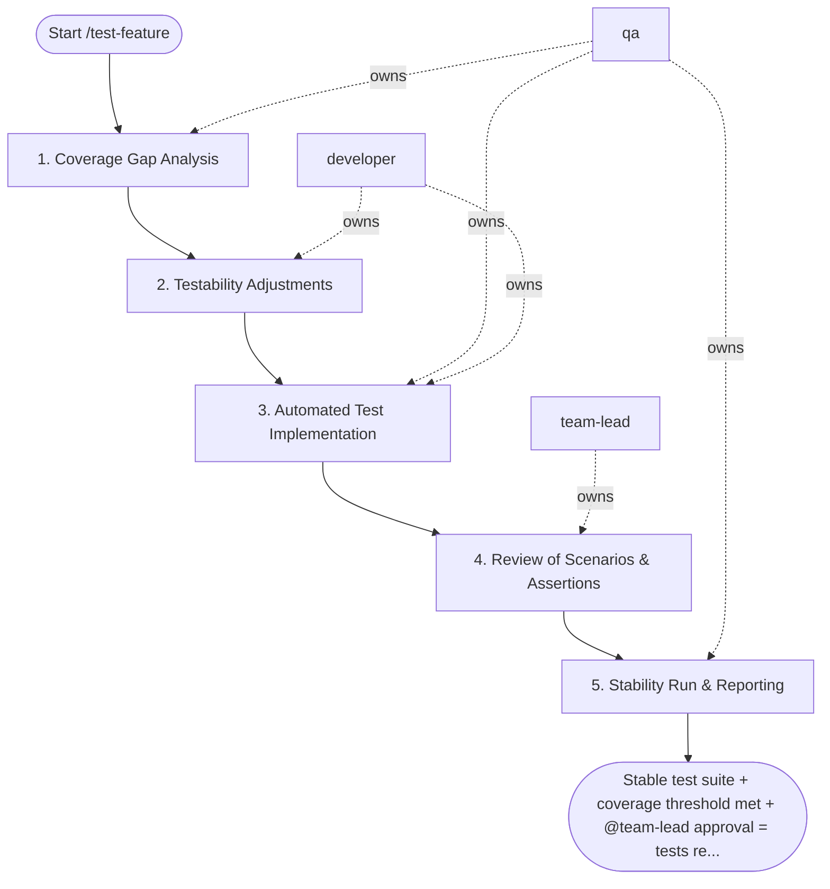

## Steps

### 1. Coverage Gap Analysis — `@qa`
- **Input:** feature scope + acceptance criteria + current test suite
- **Actions:** map acceptance criteria to existing tests; identify untested critical paths, failure paths, and edge cases; prioritize gaps by business risk (data integrity > performance > UX)
- **Output:** `test_coverage_gaps.md` — gap list with risk classification per gap
- **Done when:** gap list reviewed and prioritized; `@team-lead` agrees on scope

### 2. Testability Adjustments — `@developer`
- **Input:** coverage gap list
- **Actions:** if code is not testable (tightly coupled, no DI, no interfaces) — make minimal structural changes to enable testing; do not change behavior; expose only what is needed for test injection
- **Output:** updated code with improved testability on feature branch
- **Done when:** `@qa` can write tests against the adjusted code without workarounds

### 3. Automated Test Implementation — `@qa` + `@developer`
- **Input:** gap list + testable code
- **Actions:**
  - unit tests: cover service logic with mocked repositories; cover repository logic with test DB or mocks
  - integration tests: test API endpoints end-to-end with test client; verify DB state after mutations
  - for each test: assert meaningful behavior, not implementation details; use clear `arrange / act / assert` structure
  - `@developer` owns tests for complex internal logic; `@qa` owns scenario and contract tests
- **Output:** new test files passing locally
- **Done when:** all planned gaps covered; `make test` green

### 4. Review of Scenarios & Assertions — `@team-lead`
- **Input:** new test files
- **Actions:** verify tests assert the right things (behavior, not internals); check that failure scenarios are realistically triggered; confirm test data setup is clean and isolated; flag brittle or non-deterministic tests
- **Output:** review feedback (blocking: fix before merge / non-blocking: note for follow-up)
- **Done when:** all blocking feedback resolved

### 5. Stability Run & Reporting — `@qa`
- **Input:** reviewed test suite
- **Actions:** run full suite 3+ times in CI to confirm no flakiness; record final coverage metrics; produce `quality_report.md` with: coverage delta, scenario list, risk areas now covered, remaining known gaps
- **Output:** `quality_report.md`; stable CI run evidence
- **Done when:** zero flaky tests; coverage meets threshold; report complete

## Agent Interaction Diagram

<!-- agent-diagram:start -->

<!-- agent-diagram:end -->

## Exit
Stable test suite + coverage threshold met + `@team-lead` approval = tests ready to merge.
