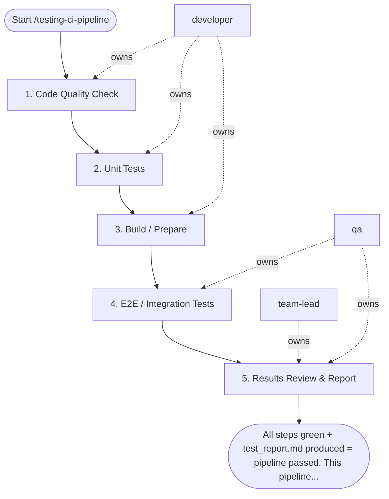

## Steps

### 1. Code Quality Check — `@developer`
- **Input:** current branch
- **Actions:** run linters and formatters using project-standard tools (e.g. `ruff` for Python, `eslint` + `prettier` for JS/TS); fix all errors — do not suppress
- **Output:** lint/format clean
- **Done when:** `make lint` exits 0; `make fmt` produces no diffs

### 2. Unit Tests — `@developer`
- **Input:** lint-clean branch
- **Actions:** run unit test suite: `make test`; confirm coverage meets project threshold (default ≥ 70%)
- **Output:** unit tests passing; coverage report
- **Done when:** `make test` exits 0; coverage threshold met

### 3. Build / Prepare — `@developer`
- **Input:** green unit tests
- **Actions:** build production artifact or Docker image (`make build` or `docker build`); confirm build succeeds with no warnings treated as errors
- **Output:** build artifact or image produced
- **Done when:** build exits 0; artifact is usable

### 4. E2E / Integration Tests — `@qa`
- **Input:** built artifact; condition: `test_scope` is `e2e` or `all`
- **Actions:** start services via Docker Compose; run blackbox/E2E suite: `make e2e-test`; capture logs and screenshots on failure
- **Output:** E2E test results; pass/fail per scenario
- **Done when:** all scenarios pass; or failures are classified (blocker vs. known flake)

### 5. Results Review & Report — `@team-lead` + `@qa`
- **Input:** lint/format results (step 1), unit test results + coverage report (step 2), build artifact (step 3), E2E/integration test results (step 4)
- **Actions:** `@qa` produces `test_report.md` — step results, coverage delta, failure details; `@team-lead` reviews and makes pipeline pass/fail decision; blocker failures must be fixed before merge
- **Output:** `test_report.md`; pipeline status: PASS / FAIL / CONDITIONAL
- **Done when:** report complete; status communicated to `@developer`

## Failure Policy
If any step fails: pipeline halts. Fix the violation before proceeding. Do not skip or suppress failures.

## Agent Interaction Diagram

<!-- agent-diagram:start -->

<!-- agent-diagram:end -->

## Exit
All steps green + `test_report.md` produced = pipeline passed. This pipeline is the reusable quality path that delivery workflows invoke for their verification phase.

**Next:** terminal — no follow-up workflow.
