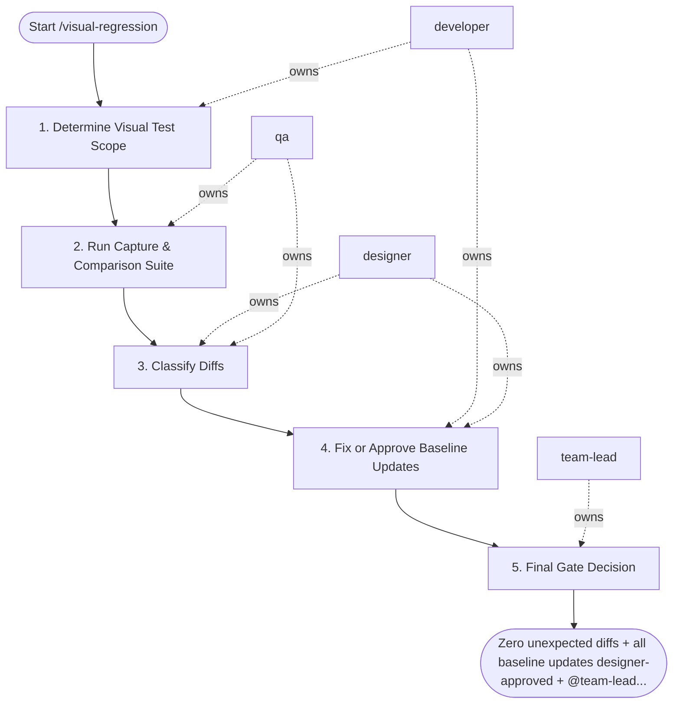

## Steps

### 1. Determine Visual Test Scope — `@developer`
- **Input:** changed UI components or routes
- **Actions:** identify which components and routes are affected by current changes; confirm baseline snapshots are up to date for the scope
- **Output:** test scope list
- **Done when:** scope defined; baseline verified

### 2. Run Capture & Comparison Suite — `@qa`
- **Input:** test scope
- **Actions:** run visual regression tool (Percy, Chromatic, Playwright snapshots) against current branch; generate diff images for all changed snapshots
- **Output:** visual diff report with diff images per component/route
- **Done when:** all diffs captured; report generated

### 3. Classify Diffs — `@designer` + `@qa`
- **Input:** visual diff report
- **Actions:** per diff: expected (intentional change matching design spec) vs. unexpected (unintended regression); `@designer` reviews all diffs involving design decisions; `@qa` flags unexpected diffs as blockers
- **Output:** classification per diff: approved / rejected / needs designer review
- **Done when:** all diffs classified; no diffs in "unknown" state

### 4. Fix or Approve Baseline Updates — `@developer` + `@designer`
- **Input:** classified diffs
- **Actions:** rejected (unexpected): `@developer` fixes the regression; approved (expected): update baseline snapshots with `@designer` explicit sign-off; document rationale for each approved baseline change
- **Output:** fixed code or updated baselines with documentation
- **Done when:** all rejected diffs fixed; all approved baselines updated with sign-off

### 5. Final Gate Decision — `@team-lead`
- **Input:** updated branch + baseline sign-offs
- **Actions:** verify all regressions fixed; confirm all approved baseline updates have designer sign-off; approve merge
- **Output:** merge approval
- **Done when:** all diffs resolved; no unreviewed changes

## Agent Interaction Diagram

<!-- agent-diagram:start -->

<!-- agent-diagram:end -->

## Exit
Zero unexpected diffs + all baseline updates designer-approved + `@team-lead` sign-off = visual review complete.

**Next:** terminal — no follow-up workflow.
