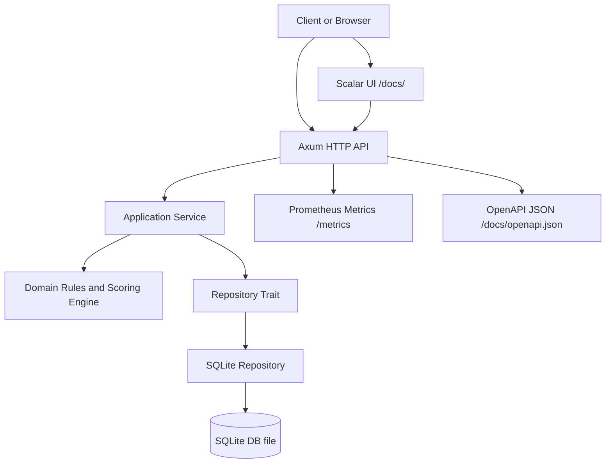

# x10

`x10` is a Rust backend for a progression game-app where daily actions change a user's balance score, derived level, and recovery buffer. The repository is currently backend-first: HTTP API, domain rules, persistence, interactive API docs, and developer tooling are all in place so future clients can build on one shared core.

## What The Service Does

- creates and stores user profiles
- stores spheres that classify tasks
- creates positive and negative tasks with day, week, month, or year cadence
- marks tasks as completed
- finalizes a day into a persisted snapshot
- calculates dashboard state from historical snapshots
- exposes health, metrics, and interactive API docs

## Quick Start

Requirements:

- Rust toolchain with `cargo`

Run locally:

```bash
make fmt
make test
make run
```

Default local URLs:

- API base: `http://127.0.0.1:3000`
- Scalar UI: `http://127.0.0.1:3000/docs/`
- OpenAPI JSON: `http://127.0.0.1:3000/docs/openapi.json`

To generate a profile id for protected calls in the docs UI:

```bash
make actor-id
```

The command creates a demo profile and prints a value you can paste into the `X-Actor-Id` header field in Scalar.

## Architecture

The codebase follows a layered backend structure:

- `src/api/` handles HTTP routing, OpenAPI generation, request parsing, response shaping, request ids, and metrics middleware
- `src/application/` contains use-case orchestration, validation, authorization checks, and business flow coordination
- `src/domain/` contains the progression model, entities, and scoring rules
- `src/infrastructure/` contains the SQLite repository implementation and persistence concerns



## Request Flow

1. A client calls an Axum route.
2. The API layer extracts payloads, path params, query params, and headers.
3. Protected routes derive the acting user from `X-Actor-Id`.
4. The application layer validates input and enforces ownership.
5. The repository loads or persists state in SQLite.
6. The domain scoring engine computes summaries, levels, and rest-day credits.
7. The API layer returns JSON plus `X-Request-Id`.

## Environment Variables

The service reads configuration from environment variables in [src/config.rs](/home/lab/work/sawrus/x10/src/config.rs).

| Variable | Required | Default | Description |
| --- | --- | --- | --- |
| `X10_HOST` | no | `127.0.0.1` | IP address the Axum server binds to |
| `X10_PORT` | no | `3000` | TCP port for the API, Scalar UI, and OpenAPI JSON |
| `X10_DATABASE_PATH` | no | `data/x10.sqlite3` | Filesystem path to the SQLite database file |

Example:

```bash
export X10_HOST=127.0.0.1
export X10_PORT=3000
export X10_DATABASE_PATH=data/x10.sqlite3
make run
```

## Business Logic

### Profiles

- a profile has identity and user metadata: full name, birth date, occupation, optional contacts, and timezone
- profile creation requires non-empty `full_name`, `occupation`, and `timezone`
- protected reads are allowed only when `X-Actor-Id` matches the target `profile_id`

### Spheres

- spheres are lightweight task categories
- a sphere must have a non-empty `name`
- tasks may reference a sphere, but the sphere must already exist

### Tasks

- each task belongs to exactly one profile
- `kind` is either `positive` or `negative`
- `weight` must be greater than zero
- `cadence` can be `day`, `week`, `month`, or `year`
- new tasks start with status `planned`
- completing a task changes status to `completed` and stores `completed_at`
- completing an already completed task returns a conflict

### Authorization Model

- the current authorization model is development-oriented
- protected routes require `X-Actor-Id`
- the acting profile id must match the resource owner
- this applies to profile reads, dashboard reads, task creation, task completion, and day finalization

### Progression Rules

The scoring engine lives in [src/domain/scoring.rs](/home/lab/work/sawrus/x10/src/domain/scoring.rs).

- only completed tasks scheduled for the requested date contribute to the daily summary
- `positive_weight` is the sum of completed positive task weights for that date
- `negative_weight` is the sum of completed negative task weights for that date
- `net_score = positive_weight - negative_weight`
- `balance_score` accumulates over time from finalized daily snapshots
- level is derived from `balance_score` and clamped to `x0` through `x10`
- default level step is `5` points per level
- if `positive_weight >= 3`, the user earns `1` `rest_day_credit`
- if `net_score < 0`, the user loses `1` `rest_day_credit` if one is available

### Day Finalization

- finalization persists a daily snapshot for a specific `profile_id` and `date`
- a day can only be finalized once
- the finalized snapshot stores:
  - the daily summary
  - cumulative balance score
  - derived level
  - current rest-day credits
  - finalization timestamp

### Dashboard

The dashboard response aggregates current progression state:

- `current.balance_score`
- `current.level`
- `current.rest_day_credits`
- `today` summary for the requested date or current logical date input
- `history` of finalized snapshots for graphing or trend visualization

## Developer Commands

| Command | Purpose |
| --- | --- |
| `make build` | Build the backend |
| `make fmt` | Format Rust code |
| `make lint` | Run clippy with warnings denied |
| `make test` | Run unit and integration-style tests |
| `make run` | Start the backend locally |
| `make actor-id` | Create a demo profile and print a usable `X-Actor-Id` |
| `make clean` | Remove build artifacts |

## API Overview

Common behaviors:

- all JSON errors use a common envelope: `error.code`, `error.message`, `error.request_id`
- successful JSON responses include `X-Request-Id` in the response headers
- protected routes require `X-Actor-Id`

### API Table

| Method | Path | Auth | Purpose | Request Body | Success Response |
| --- | --- | --- | --- | --- | --- |
| `GET` | `/health` | no | Basic service liveness check | none | `200` with `{ "status": "ok" }` |
| `GET` | `/metrics` | no | Prometheus metrics endpoint | none | `200` text payload or `503` if metrics are disabled |
| `GET` | `/docs/` | no | Scalar web UI for interactive API calls | none | `200` HTML |
| `GET` | `/docs/openapi.json` | no | Generated OpenAPI 3.1 document | none | `200` JSON |
| `GET` | `/api/v1/spheres` | no | List known spheres | none | `200` with `Sphere[]` |
| `POST` | `/api/v1/spheres` | no | Create a new sphere | `name` | `201` with `Sphere` |
| `POST` | `/api/v1/profiles` | no | Create a profile | `full_name`, `birth_date`, `occupation`, optional `telegram`, optional `email`, `timezone` | `201` with `Profile` |
| `GET` | `/api/v1/profiles/{profile_id}` | yes | Read a profile owned by the acting user | none | `200` with `Profile` |
| `GET` | `/api/v1/profiles/{profile_id}/dashboard` | yes | Read dashboard state and snapshot history | none, optional `date` query | `200` with `Dashboard` |
| `POST` | `/api/v1/profiles/{profile_id}/days/{date}/finalize` | yes | Finalize one day into a stored snapshot | none | `200` with `DailySnapshot` |
| `POST` | `/api/v1/tasks` | yes | Create a planned task for a profile | `profile_id`, `title`, optional `sphere_id`, `kind`, `weight`, `cadence`, `scheduled_for` | `201` with `Task` |
| `POST` | `/api/v1/tasks/{task_id}/complete` | yes | Mark a task as completed | none | `200` with updated `Task` |

## Key Data Shapes

### Profile

```json
{
  "id": "uuid",
  "full_name": "Alice Example",
  "birth_date": "1990-01-01",
  "occupation": "Engineer",
  "telegram": "@alice",
  "email": "alice@example.com",
  "timezone": "Europe/Samara"
}
```

### Task

```json
{
  "id": "uuid",
  "profile_id": "uuid",
  "title": "Morning run",
  "sphere_id": "uuid",
  "kind": "positive",
  "weight": 2,
  "cadence": "day",
  "scheduled_for": "2026-07-01",
  "status": "planned",
  "completed_at": null
}
```

### Dashboard

```json
{
  "profile_id": "uuid",
  "current": {
    "balance_score": 8,
    "level": "x1",
    "rest_day_credits": 1
  },
  "today": {
    "date": "2026-07-01",
    "positive_weight": 3,
    "negative_weight": 1,
    "net_score": 2
  },
  "history": []
}
```

## Interactive Docs Workflow

1. Start the backend with `make run`.
2. Run `make actor-id`.
3. Open `http://127.0.0.1:3000/docs/`.
4. Paste the generated value into the `X-Actor-Id` header for protected requests.
5. Call the API directly from the browser UI on the same service port.

## Observability

- `GET /health` exposes liveness
- `GET /metrics` exposes Prometheus-compatible metrics
- every request receives an `X-Request-Id`
- request lifecycle and status are logged through `tracing`

## Repository Notes

- bootstrap feature docs live under [docs/backend-bootstrap/README.md](/home/lab/work/sawrus/x10/docs/backend-bootstrap/README.md)
- interactive docs feature docs live under [docs/api-docs-ui/README.md](/home/lab/work/sawrus/x10/docs/api-docs-ui/README.md)
