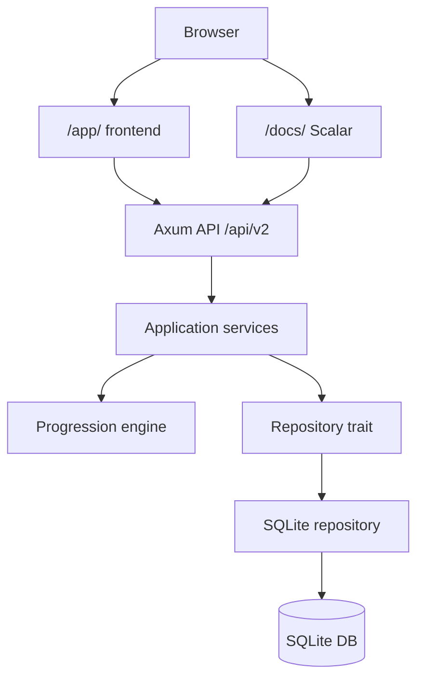

# x10

`x10` is a progression game app built around planned tasks, execution events, a signed balance ledger, per-profile level ladders, and a game-style web dashboard.

## What Ships In `0.3.0`

- versioned SQLite migrations with a breaking `v2` schema
- Rust backend with CRUD for profiles, photos, spheres, tasks, executions, levels, balances, and day finalizations
- append-only balance ledger generated automatically from task executions
- per-profile levels selected from accumulated balance
- game-style web frontend at `/app/` with `dendy` and `apple` themes
- OpenAPI + Scalar docs at `/docs/`

## Quick Start

Requirements:

- Rust toolchain with `cargo`

Run locally:

```bash
make fmt
make test
make run
```

Default local URLs:

- API base: `http://127.0.0.1:3000`
- Web app: `http://127.0.0.1:3000/app/`
- Scalar UI: `http://127.0.0.1:3000/docs/`
- OpenAPI JSON: `http://127.0.0.1:3000/docs/openapi.json`

Generate a dev actor/profile id:

```bash
make actor-id
```

## Architecture

- `src/api/` handles Axum routing, request parsing, error envelopes, metrics, OpenAPI, and static web delivery
- `src/application/` contains orchestration, validation, ownership checks, photo storage, and progression workflows
- `src/domain/` contains the event-driven progression model and balance/level helpers
- `src/infrastructure/` contains the SQLite repository and versioned migration bootstrapping
- `web/` contains the standalone frontend source and built bundle



## Environment Variables

The service reads configuration from [src/config.rs](/home/lab/work/sawrus/x10/src/config.rs).

| Variable | Required | Default | Description |
| --- | --- | --- | --- |
| `X10_HOST` | no | `127.0.0.1` | IP address the Axum server binds to |
| `X10_PORT` | no | `3000` | TCP port for API, web app, Scalar, and OpenAPI |
| `X10_DATABASE_PATH` | no | `data/x10.sqlite3` | SQLite database file |
| `X10_UPLOADS_PATH` | no | `data/uploads` | Local directory for uploaded profile photos |
| `X10_WEB_DIST_PATH` | no | `web/dist` | Directory served for the game-style frontend |

## Core Rules

### Authorization

- protected routes require `X-Actor-Id`
- the actor must match the target `profile_id`
- profile photos, tasks, executions, balances, levels, dashboard, and day finalizations all enforce object ownership

### Tasks and Executions

- tasks are reusable plans, not completion records
- `kind` is `positive` or `negative`
- `planned_weight > 0`
- `planned_score` is `1..=5`
- `planned_rate` is `0..=100`
- `starts_on + cadence` define the recurrence anchor
- multiple executions per recurrence period are allowed
- each execution captures `actual_score`, `actual_rate`, `completed_at`, and computed period bounds

### Balance and Levels

- every execution appends one `profile_balances` row
- `actual_weight` is signed from task kind:
  - positive task => `+planned_weight`
  - negative task => `-planned_weight`
- `balance_after` is cumulative and append-only
- current level is derived from the latest balance against that profile's level table
- level target score/rate fields are motivational metadata, not the source of truth for level selection

### Day Finalization

- `finalize day` remains a ritual event
- it stores a `day_finalizations` row with optional note
- it does not recalculate or lock balance

## Developer Commands

| Command | Purpose |
| --- | --- |
| `make build` | Build web bundle and backend |
| `make fmt` | Format Rust code |
| `make lint` | Run clippy with warnings denied |
| `make test` | Run frontend smoke tests and backend tests |
| `make run` | Build web bundle and start the backend |
| `make web-build` | Copy `web/src` into `web/dist` |
| `make web-test` | Run lightweight frontend smoke checks |
| `make actor-id` | Create a demo profile and print a usable `X-Actor-Id` |
| `make clean` | Remove Cargo build artifacts |

## API Conventions

- all JSON errors use `error.code`, `error.message`, `error.request_id`
- responses include `X-Request-Id`
- binary photo download uses `GET /api/v2/photos/{photo_id}`
- protected routes require `X-Actor-Id`

## API Table

| Method | Path | Auth | Purpose | Request Body | Success |
| --- | --- | --- | --- | --- | --- |
| `GET` | `/health` | no | Liveness check | none | `200` JSON |
| `GET` | `/metrics` | no | Prometheus metrics | none | `200` text or `503` |
| `GET` | `/app/` | no | Game frontend | none | `200` HTML |
| `GET` | `/docs/` | no | Scalar UI | none | `200` HTML |
| `GET` | `/docs/openapi.json` | no | OpenAPI JSON | none | `200` JSON |
| `POST` | `/api/v2/profiles` | no | Create a profile and seed default levels | `full_name`, `birth_date`, `occupation`, optional `telegram`, optional `email`, `timezone` | `201` `Profile` |
| `GET` | `/api/v2/profiles/{profile_id}` | yes | Read owned profile | none | `200` `Profile` |
| `PATCH` | `/api/v2/profiles/{profile_id}` | yes | Update owned profile | partial profile fields | `200` `Profile` |
| `POST` | `/api/v2/profiles/{profile_id}/photos` | yes | Upload local profile photo | multipart `file` | `201` `ProfilePhotoSummary` |
| `GET` | `/api/v2/profiles/{profile_id}/photos` | yes | List owned photo metadata | none | `200` `ProfilePhotoSummary[]` |
| `GET` | `/api/v2/photos/{photo_id}` | yes | Download owned photo bytes | none | `200` binary |
| `DELETE` | `/api/v2/photos/{photo_id}` | yes | Delete owned photo if not selected | none | `204` |
| `POST` | `/api/v2/profiles/{profile_id}/photos/{photo_id}/select` | yes | Make photo current avatar | none | `200` `Profile` |
| `GET` | `/api/v2/spheres` | no | List spheres | none | `200` `Sphere[]` |
| `POST` | `/api/v2/spheres` | no | Create sphere | `name`, `weight` | `201` `Sphere` |
| `GET` | `/api/v2/spheres/{sphere_id}` | no | Read sphere | none | `200` `Sphere` |
| `PATCH` | `/api/v2/spheres/{sphere_id}` | no | Update sphere | partial `name`, `weight` | `200` `Sphere` |
| `DELETE` | `/api/v2/spheres/{sphere_id}` | no | Delete sphere | none | `204` |
| `POST` | `/api/v2/tasks` | yes | Create planned task | `profile_id`, `title`, optional `sphere_id`, `kind`, `planned_weight`, `planned_score`, `planned_rate`, `cadence`, `starts_on` | `201` `Task` |
| `GET` | `/api/v2/profiles/{profile_id}/tasks` | yes | List owned tasks in canonical order | none | `200` `Task[]` |
| `GET` | `/api/v2/tasks/{task_id}` | yes | Read owned task | none | `200` `Task` |
| `PATCH` | `/api/v2/tasks/{task_id}` | yes | Update owned task | partial task fields | `200` `Task` |
| `DELETE` | `/api/v2/tasks/{task_id}` | yes | Delete owned task | none | `204` |
| `POST` | `/api/v2/tasks/{task_id}/executions` | yes | Create execution and append ledger row | `actual_score`, `actual_rate`, optional `completed_at` | `201` `TaskExecution` |
| `GET` | `/api/v2/profiles/{profile_id}/executions` | yes | List owned executions | none | `200` `TaskExecution[]` |
| `GET` | `/api/v2/executions/{execution_id}` | yes | Read owned execution | none | `200` `TaskExecution` |
| `DELETE` | `/api/v2/executions/{execution_id}` | yes | Delete execution and rebuild balances | none | `204` |
| `GET` | `/api/v2/profiles/{profile_id}/balances` | yes | List append-only balance history | none | `200` `ProfileBalance[]` |
| `GET` | `/api/v2/profiles/{profile_id}/dashboard` | yes | Read profile header, tasks, executions, balances, levels, and finalizations | none | `200` `Dashboard` |
| `GET` | `/api/v2/profiles/{profile_id}/levels` | yes | List owned levels | none | `200` `Level[]` |
| `POST` | `/api/v2/profiles/{profile_id}/levels` | yes | Create owned level | `code`, `ordinal`, `min_balance`, `target_planned_score`, `target_planned_rate` | `201` `Level` |
| `PATCH` | `/api/v2/levels/{level_id}` | yes | Update owned level | partial level fields | `200` `Level` |
| `DELETE` | `/api/v2/levels/{level_id}` | yes | Delete owned level if at least one remains | none | `204` |
| `POST` | `/api/v2/profiles/{profile_id}/days/{date}/finalize` | yes | Store ritual day finalization | optional `note` | `201` `DayFinalization` |
| `GET` | `/api/v2/profiles/{profile_id}/days/finalizations` | yes | List ritual day finalizations | none | `200` `DayFinalization[]` |

## UI Loop

1. Create a profile once and keep `X-Actor-Id` in local storage.
2. Upload/select a photo.
3. Create planned tasks in the left panel.
4. Execute the same ordered queue in the right panel.
5. Watch `profile_balances` move the chart and current level.
6. Optionally finalize the day with a note.

## Related Docs

- [Feature docs](/home/lab/work/sawrus/x10/docs/progression-redesign/README.md)
- [Epic plan](/home/lab/work/sawrus/x10/docs/progression-redesign/epic_plan.md)
- [Architecture notes](/home/lab/work/sawrus/x10/docs/progression-redesign/architecture_notes.md)
- [Test report](/home/lab/work/sawrus/x10/docs/progression-redesign/test_report.md)
- [Delivery summary](/home/lab/work/sawrus/x10/docs/progression-redesign/delivery_summary.md)
