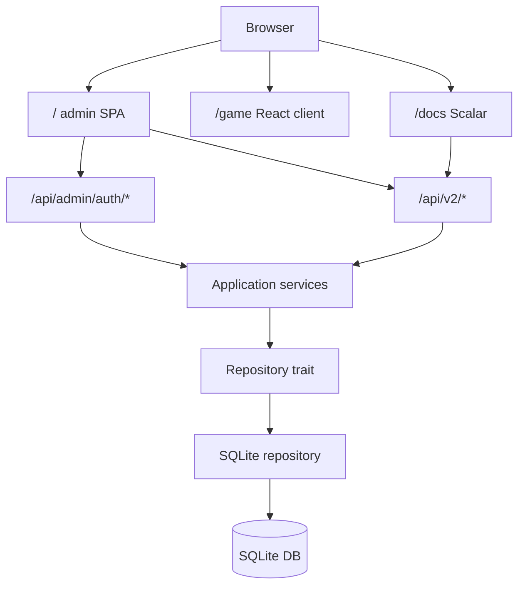

# x10

`x10` is a Rust + SQLite service that now ships a Vuetify-based CRUD admin panel at `/`, a React-based game frontend at `/game`, and the existing progression API under `/api/v2`.

## What Ships In `0.4.2`

- Vuetify admin panel served from `/`
- separate React game frontend served from `/game`
- admin authentication with `username + argon2 password hash + http-only cookie session`
- CRUD management for profiles, photos, spheres, tasks, executions, levels, and day finalizations
- read-only admin visibility for balances and profile level state
- updated OpenAPI + Scalar docs at `/docs/`

## Quick Start

Requirements:

- Rust toolchain with `cargo`
- Node.js + npm

Generate an admin password hash:

```bash
cargo run --bin hash_admin_password -- admin123
```

Run locally:

```bash
export X10_ADMIN_USERNAME=admin
export X10_ADMIN_PASSWORD_HASH='<paste argon2 hash>'
export X10_ADMIN_SESSION_SECRET='replace-me'
make fmt
make test
make run
```

Default local URLs:

- Admin app: `http://127.0.0.1:3000/`
- Game frontend: `http://127.0.0.1:3000/game`
- Scalar UI: `http://127.0.0.1:3000/docs/`
- OpenAPI JSON: `http://127.0.0.1:3000/docs/openapi.json`

## Architecture

- `src/api/` handles Axum routing, admin session middleware, DTO mapping, errors, metrics, OpenAPI, and static file delivery
- `src/application/` contains validation, ownership checks, upload coordination, and progression workflows
- `src/domain/` contains the progression model and scoring helpers
- `src/infrastructure/` contains the SQLite repository and migrations
- `web/` contains the Vite + Vue 3 + Vuetify frontend



## Environment Variables

The service reads configuration from [src/config.rs](/home/lab/work/sawrus/x10/src/config.rs).

| Variable | Required | Default | Description |
| --- | --- | --- | --- |
| `X10_HOST` | no | `127.0.0.1` | IP address the Axum server binds to |
| `X10_PORT` | no | `3000` | TCP port for API, admin app, game frontend, Scalar, and OpenAPI |
| `X10_DATABASE_PATH` | no | `data/x10.sqlite3` | SQLite database file |
| `X10_UPLOADS_PATH` | no | `data/uploads` | Local directory for uploaded profile photos |
| `X10_WEB_DIST_PATH` | no | `web/dist` | Directory served for the built frontend bundle |
| `X10_ADMIN_USERNAME` | yes | none | Admin login username |
| `X10_ADMIN_PASSWORD_HASH` | yes | none | Argon2 PHC password hash |
| `X10_ADMIN_SESSION_SECRET` | yes | none | Secret used to sign the session cookie |
| `X10_ADMIN_SESSION_SECURE` | no | `false` | Adds the `Secure` cookie attribute when true |

## Auth Model

- `/api/admin/auth/login` accepts username and password
- successful login issues an `x10_admin_session` HTTP-only cookie
- all `/api/v2/*` and `/api/admin/*` routes except `/api/admin/auth/*` require a valid admin session
- profile-scoped `v2` routes still require `X-Actor-Id`; the admin UI sets it to the selected profile id

## CRUD Scope

- Full CRUD:
  - profiles
  - profile photos
  - spheres
  - tasks
  - executions
  - levels
  - day finalizations
- Read-only:
  - balances
  - profile level state

## Developer Commands

| Command | Purpose |
| --- | --- |
| `make build` | Build the Vite frontend and Rust backend |
| `make fmt` | Format Rust code |
| `make lint` | Run clippy with warnings denied |
| `make test` | Run frontend smoke tests and backend tests |
| `make run` | Build web bundle and start the backend |
| `make web-build` | Build the admin and game frontend bundles |
| `make web-test` | Run frontend smoke checks |
| `make game-build` | Build only the React game frontend into `web/game/dist` |
| `make game-dev` | Start the React game frontend dev server |
| `make actor-id` | Create a demo profile and print a usable `X-Actor-Id` |
| `make clean` | Remove Cargo build artifacts |

## API Highlights

- Public:
  - `GET /`
  - `GET /game`
  - `GET /docs/`
  - `GET /docs/openapi.json`
  - `POST /api/admin/auth/login`
  - `POST /api/admin/auth/logout`
  - `GET /api/admin/auth/session`
- Admin:
  - `GET /api/admin/profiles`
  - `DELETE /api/admin/profiles/{profile_id}`
  - `GET /api/admin/profiles/{profile_id}/level-state`
- Profile-scoped progression CRUD remains under `/api/v2/*`

See [docs/admin-vuetify/api.md](/home/lab/work/sawrus/x10/docs/admin-vuetify/api.md) for the detailed contract.

## Related Docs

- [Feature README](/home/lab/work/sawrus/x10/docs/admin-vuetify/README.md)
- [Implementation plan](/home/lab/work/sawrus/x10/docs/admin-vuetify/implementation_plan.md)
- [API notes](/home/lab/work/sawrus/x10/docs/admin-vuetify/api.md)
- [Operations notes](/home/lab/work/sawrus/x10/docs/admin-vuetify/operations.md)
- [Test report](/home/lab/work/sawrus/x10/docs/admin-vuetify/test_report.md)
- [Delivery summary](/home/lab/work/sawrus/x10/docs/admin-vuetify/delivery_summary.md)
