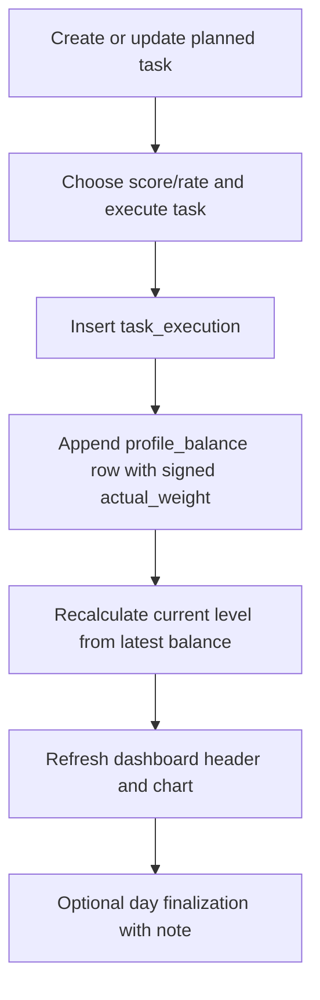

# Progression Redesign

This feature turns `x10` into an event-driven progression game where every execution changes a persistent balance trail and therefore the active level.

## Table Catalog

| Table | Purpose |
| --- | --- |
| `profiles` | Core user identity and current selected photo |
| `profile_photos` | Local image metadata for uploaded avatars |
| `spheres` | Shared task categories with weight |
| `tasks` | Planned templates for recurring work |
| `task_executions` | Actual task completion events |
| `profile_balances` | Append-only ledger rows created from executions |
| `levels` | Per-profile level definitions |
| `profile_level_state` | Current resolved level for each profile |
| `day_finalizations` | Ritual close markers for a day |
| `schema_migrations` | Applied migration versions |

## Table Details

### `profiles`

| Column | Type | Required | Description | Business logic |
| --- | --- | --- | --- | --- |
| `id` | `TEXT` UUID | yes | Primary key | profile owner id and `X-Actor-Id` match target |
| `full_name` | `TEXT` | yes | Display name | shown in header and used in avatar fallback |
| `birth_date` | `TEXT` date | yes | Birth date | profile metadata only |
| `occupation` | `TEXT` | yes | Role/occupation | shown in header |
| `telegram` | `TEXT` | no | Optional contact | metadata only |
| `email` | `TEXT` | no | Optional contact | metadata only |
| `timezone` | `TEXT` | yes | Logical timezone | profile metadata |
| `current_photo_id` | `TEXT` UUID | no | FK to current avatar | selected via photo selection endpoint |
| `created_at` | `TEXT` RFC3339 | yes | Creation time | audit |
| `updated_at` | `TEXT` RFC3339 | yes | Update time | audit |

### `profile_photos`

| Column | Type | Required | Description | Business logic |
| --- | --- | --- | --- | --- |
| `id` | `TEXT` UUID | yes | Primary key | public photo identifier |
| `profile_id` | `TEXT` UUID | yes | FK to owner profile | owner-scoped access |
| `storage_path` | `TEXT` | yes | Relative local file path | backend reads bytes from uploads directory |
| `original_name` | `TEXT` | yes | Original file name | shown in web UI |
| `mime_type` | `TEXT` | yes | Content type | used for download response |
| `size_bytes` | `INTEGER` | yes | File size | smoke validation only |
| `width` | `INTEGER` | no | Optional image width | reserved for future enrichment |
| `height` | `INTEGER` | no | Optional image height | reserved for future enrichment |
| `created_at` | `TEXT` RFC3339 | yes | Creation time | audit |
| `updated_at` | `TEXT` RFC3339 | yes | Update time | audit |

### `spheres`

| Column | Type | Required | Description | Business logic |
| --- | --- | --- | --- | --- |
| `id` | `TEXT` UUID | yes | Primary key | referenced by tasks |
| `name` | `TEXT` | yes | Unique sphere name | reference data |
| `weight` | `INTEGER` | yes | Sphere weight | exposed to planning UI |
| `created_at` | `TEXT` RFC3339 | yes | Creation time | audit |
| `updated_at` | `TEXT` RFC3339 | yes | Update time | audit |

### `tasks`

| Column | Type | Required | Description | Business logic |
| --- | --- | --- | --- | --- |
| `id` | `TEXT` UUID | yes | Primary key | reusable planned task id |
| `profile_id` | `TEXT` UUID | yes | FK to owner profile | owner-scoped |
| `sphere_id` | `TEXT` UUID | no | Optional FK to sphere | category only |
| `title` | `TEXT` | yes | Task title | primary planner label |
| `kind` | `TEXT` enum | yes | `positive` or `negative` | controls signed ledger effect |
| `planned_weight` | `INTEGER` | yes | Weight magnitude | ledger delta source |
| `planned_score` | `INTEGER` | yes | Intended score `1..5` | UI guidance and motivational metadata |
| `planned_rate` | `INTEGER` | yes | Intended rate `0..100` | UI guidance and motivational metadata |
| `cadence` | `TEXT` enum | yes | `day`, `week`, `month`, `year` | recurrence anchor |
| `starts_on` | `TEXT` date | yes | Recurrence start | period calculation anchor |
| `status` | `TEXT` enum | yes | `planned`, `archived`, `skipped` | execution allowed only for `planned` |
| `created_at` | `TEXT` RFC3339 | yes | Creation time | canonical task ordering tie-break |
| `updated_at` | `TEXT` RFC3339 | yes | Update time | audit |

### `task_executions`

| Column | Type | Required | Description | Business logic |
| --- | --- | --- | --- | --- |
| `id` | `TEXT` UUID | yes | Primary key | execution event id |
| `task_id` | `TEXT` UUID | yes | FK to planned task | source template |
| `profile_id` | `TEXT` UUID | yes | FK to owner profile | owner-scoped |
| `actual_score` | `INTEGER` | yes | Actual score `1..5` | user-entered close quality |
| `actual_rate` | `INTEGER` | yes | Actual rate `0..100` | user-entered close quality |
| `completed_at` | `TEXT` RFC3339 | yes | Completion instant | execution chronology |
| `period_start` | `TEXT` date | yes | Computed recurring period start | cadence anchor output |
| `period_end` | `TEXT` date | yes | Computed recurring period end | cadence anchor output |
| `created_at` | `TEXT` RFC3339 | yes | Insert time | ledger ordering |

### `profile_balances`

| Column | Type | Required | Description | Business logic |
| --- | --- | --- | --- | --- |
| `id` | `TEXT` UUID | yes | Primary key | ledger row id |
| `profile_id` | `TEXT` UUID | yes | FK to owner profile | owner-scoped |
| `task_execution_id` | `TEXT` UUID | yes | Unique FK to execution | one ledger row per execution |
| `actual_rate` | `INTEGER` | yes | Mirrored execution rate | chart/detail metadata |
| `actual_score` | `INTEGER` | yes | Mirrored execution score | chart/detail metadata |
| `actual_weight` | `INTEGER` | yes | Signed weight delta | `+planned_weight` or `-planned_weight` |
| `balance_after` | `INTEGER` | yes | Cumulative balance after event | source of current level |
| `created_at` | `TEXT` RFC3339 | yes | Ledger timestamp | chart order |

### `levels`

| Column | Type | Required | Description | Business logic |
| --- | --- | --- | --- | --- |
| `id` | `TEXT` UUID | yes | Primary key | level identifier |
| `profile_id` | `TEXT` UUID | yes | FK to owner profile | level ladder is personal |
| `code` | `TEXT` | yes | e.g. `x1`, `x2`, `x10` | shown in header |
| `ordinal` | `INTEGER` | yes | Sorting index | lowest ordinal is entry level |
| `min_balance` | `INTEGER` | yes | Threshold | current level selection source |
| `target_planned_score` | `INTEGER` | yes | Intended score target | motivational metadata |
| `target_planned_rate` | `INTEGER` | yes | Intended rate target | motivational metadata |
| `created_at` | `TEXT` RFC3339 | yes | Creation time | audit |
| `updated_at` | `TEXT` RFC3339 | yes | Update time | audit |

### `profile_level_state`

| Column | Type | Required | Description | Business logic |
| --- | --- | --- | --- | --- |
| `profile_id` | `TEXT` UUID | yes | PK and FK to profile | one current state row per profile |
| `current_level_id` | `TEXT` UUID | yes | FK to current level | resolved after execution or level change |
| `last_balance_id` | `TEXT` UUID | no | FK to latest ledger row | links current level to latest balance |
| `updated_at` | `TEXT` RFC3339 | yes | Recalc time | audit |

### `day_finalizations`

| Column | Type | Required | Description | Business logic |
| --- | --- | --- | --- | --- |
| `id` | `TEXT` UUID | yes | Primary key | finalization event id |
| `profile_id` | `TEXT` UUID | yes | FK to owner profile | owner-scoped |
| `date` | `TEXT` date | yes | Finalized day | unique per profile/day |
| `note` | `TEXT` | no | Optional ritual note | non-scoring annotation |
| `created_at` | `TEXT` RFC3339 | yes | Insert time | audit |

## Game Flow

## API Docs

The public API table is maintained in [README.md](/home/lab/work/sawrus/x10/README.md).
